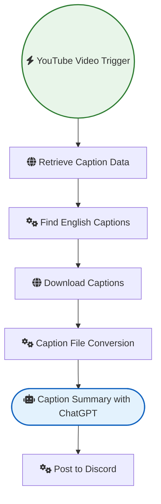

```mermaid
graph TD
    classDef trigger fill:#e8f5e9,stroke:#2e7d32,stroke-width:2px;
    classDef ai fill:#e3f2fd,stroke:#1565c0,stroke-width:2px;
    classDef logic fill:#fff3e0,stroke:#ef6c00,stroke-width:2px;

    YouTube_Video_Trigger(("fas:fa-bolt YouTube Video Trigger")):::trigger
    Retrieve_Caption_Data["fas:fa-globe Retrieve Caption Data"]
    Download_Captions["fas:fa-globe Download Captions"]
    Caption_File_Conversion["fas:fa-cogs Caption File Conversion"]
    Caption_Summary_with_ChatGPT(["fas:fa-robot Caption Summary with ChatGPT"]):::ai
    Post_to_Discord["fas:fa-cogs Post to Discord"]
    Find_English_Captions["fas:fa-cogs Find English Captions"]

    Download_Captions --> Caption_File_Conversion
    Find_English_Captions --> Download_Captions
    Retrieve_Caption_Data --> Find_English_Captions
    YouTube_Video_Trigger --> Retrieve_Caption_Data
    Caption_File_Conversion --> Caption_Summary_with_ChatGPT
    Caption_Summary_with_ChatGPT --> Post_to_Discord
```
