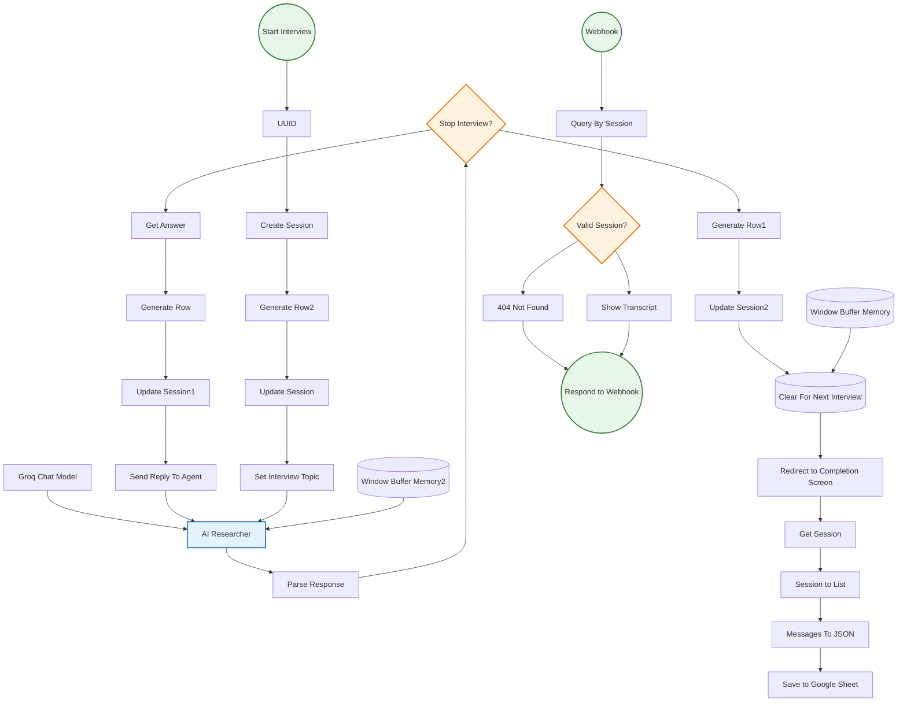

```mermaid
graph TD
    classDef trigger fill:#e8f5e9,stroke:#2e7d32,stroke-width:2px;
    classDef ai fill:#e3f2fd,stroke:#1565c0,stroke-width:2px;
    classDef logic fill:#fff3e0,stroke:#ef6c00,stroke-width:2px;

    Stop_Interview_{"Stop Interview?"}:::logic
    Generate_Row["Generate Row"]
    Generate_Row1["Generate Row1"]
    Clear_For_Next_Interview[("Clear For Next Interview")]
    Send_Reply_To_Agent["Send Reply To Agent"]
    Start_Interview(("Start Interview")):::trigger
    Get_Answer["Get Answer"]
    Set_Interview_Topic["Set Interview Topic"]
    UUID["UUID"]
    Generate_Row2["Generate Row2"]
    Create_Session["Create Session"]
    Update_Session["Update Session"]
    Update_Session1["Update Session1"]
    Update_Session2["Update Session2"]
    Valid_Session_{"Valid Session?"}:::logic
    Respond_to_Webhook(("Respond to Webhook")):::trigger
    Window_Buffer_Memory2[("Window Buffer Memory2")]
    Window_Buffer_Memory[("Window Buffer Memory")]
    Redirect_to_Completion_Screen["Redirect to Completion Screen"]
    Webhook(("Webhook")):::trigger
    n_404_Not_Found["404 Not Found"]
    AI_Researcher["AI Researcher"]:::ai
    Parse_Response["Parse Response"]
    Groq_Chat_Model["Groq Chat Model"]
    Show_Transcript["Show Transcript"]
    Save_to_Google_Sheet["Save to Google Sheet"]
    Session_to_List["Session to List"]
    Messages_To_JSON["Messages To JSON"]
    Query_By_Session["Query By Session"]
    Get_Session["Get Session"]

    UUID --> Create_Session
    Webhook --> Query_By_Session
    Get_Answer --> Generate_Row
    Get_Session --> Session_to_List
    Generate_Row --> Update_Session1
    n_404_Not_Found --> Respond_to_Webhook
    AI_Researcher --> Parse_Response
    Generate_Row1 --> Update_Session2
    Generate_Row2 --> Update_Session
    Create_Session --> Generate_Row2
    Parse_Response --> Stop_Interview_
    Update_Session --> Set_Interview_Topic
    Valid_Session_ --> Show_Transcript
    Valid_Session_ --> n_404_Not_Found
    Groq_Chat_Model --> AI_Researcher
    Session_to_List --> Messages_To_JSON
    Show_Transcript --> Respond_to_Webhook
    Start_Interview --> UUID
    Stop_Interview_ --> Generate_Row1
    Stop_Interview_ --> Get_Answer
    Update_Session1 --> Send_Reply_To_Agent
    Update_Session2 --> Clear_For_Next_Interview
    Messages_To_JSON --> Save_to_Google_Sheet
    Query_By_Session --> Valid_Session_
    Send_Reply_To_Agent --> AI_Researcher
    Set_Interview_Topic --> AI_Researcher
    Window_Buffer_Memory --> Clear_For_Next_Interview
    Window_Buffer_Memory2 --> AI_Researcher
    Clear_For_Next_Interview --> Redirect_to_Completion_Screen
    Redirect_to_Completion_Screen --> Get_Session
```
