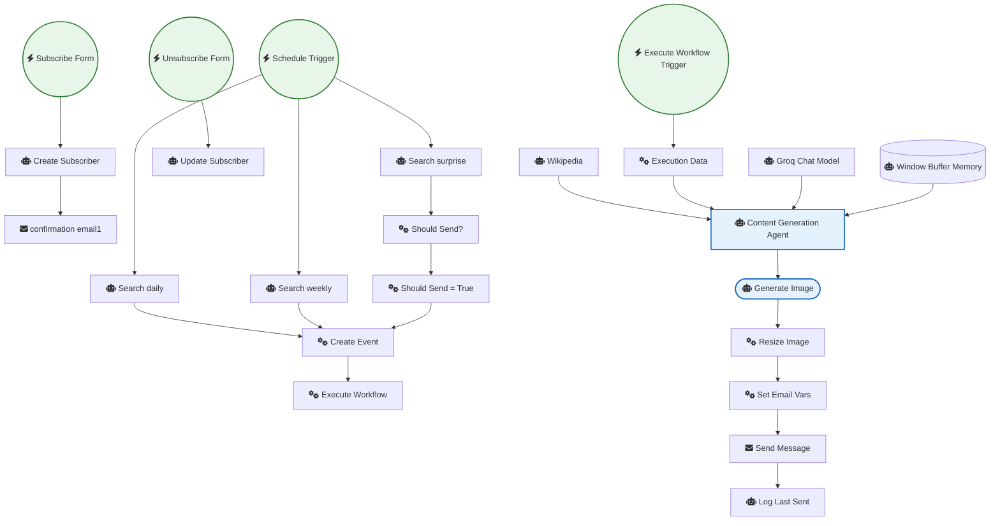

```mermaid
graph TD
    classDef trigger fill:#e8f5e9,stroke:#2e7d32,stroke-width:2px;
    classDef ai fill:#e3f2fd,stroke:#1565c0,stroke-width:2px;
    classDef logic fill:#fff3e0,stroke:#ef6c00,stroke-width:2px;

    Schedule_Trigger(("fas:fa-bolt Schedule Trigger")):::trigger
    Search_daily["fas:fa-robot Search daily"]
    Search_weekly["fas:fa-robot Search weekly"]
    confirmation_email1["fas:fa-envelope confirmation email1"]
    Execute_Workflow["fas:fa-cogs Execute Workflow"]
    Create_Event["fas:fa-cogs Create Event"]
    Execute_Workflow_Trigger(("fas:fa-bolt Execute Workflow Trigger")):::trigger
    Unsubscribe_Form(("fas:fa-bolt Unsubscribe Form")):::trigger
    Set_Email_Vars["fas:fa-cogs Set Email Vars"]
    Log_Last_Sent["fas:fa-robot Log Last Sent"]
    Search_surprise["fas:fa-robot Search surprise"]
    Should_Send___True["fas:fa-cogs Should Send = True"]
    Should_Send_["fas:fa-cogs Should Send?"]
    Create_Subscriber["fas:fa-robot Create Subscriber"]
    Update_Subscriber["fas:fa-robot Update Subscriber"]
    Subscribe_Form(("fas:fa-bolt Subscribe Form")):::trigger
    Execution_Data["fas:fa-cogs Execution Data"]
    Window_Buffer_Memory[("fas:fa-robot Window Buffer Memory")]
    Wikipedia["fas:fa-robot Wikipedia"]
    Content_Generation_Agent["fas:fa-robot Content Generation Agent"]:::ai
    Groq_Chat_Model["fas:fa-robot Groq Chat Model"]
    Generate_Image(["fas:fa-robot Generate Image"]):::ai
    Resize_Image["fas:fa-cogs Resize Image"]
    Send_Message["fas:fa-envelope Send Message"]

    Wikipedia --> Content_Generation_Agent
    Create_Event --> Execute_Workflow
    Resize_Image --> Set_Email_Vars
    Search_daily --> Create_Event
    Send_Message --> Log_Last_Sent
    Should_Send_ --> Should_Send___True
    Search_weekly --> Create_Event
    Execution_Data --> Content_Generation_Agent
    Generate_Image --> Resize_Image
    Set_Email_Vars --> Send_Message
    Subscribe_Form --> Create_Subscriber
    Groq_Chat_Model --> Content_Generation_Agent
    Search_surprise --> Should_Send_
    Schedule_Trigger --> Search_surprise
    Schedule_Trigger --> Search_daily
    Schedule_Trigger --> Search_weekly
    Unsubscribe_Form --> Update_Subscriber
    Create_Subscriber --> confirmation_email1
    Should_Send___True --> Create_Event
    Window_Buffer_Memory --> Content_Generation_Agent
    Content_Generation_Agent --> Generate_Image
    Execute_Workflow_Trigger --> Execution_Data
```
