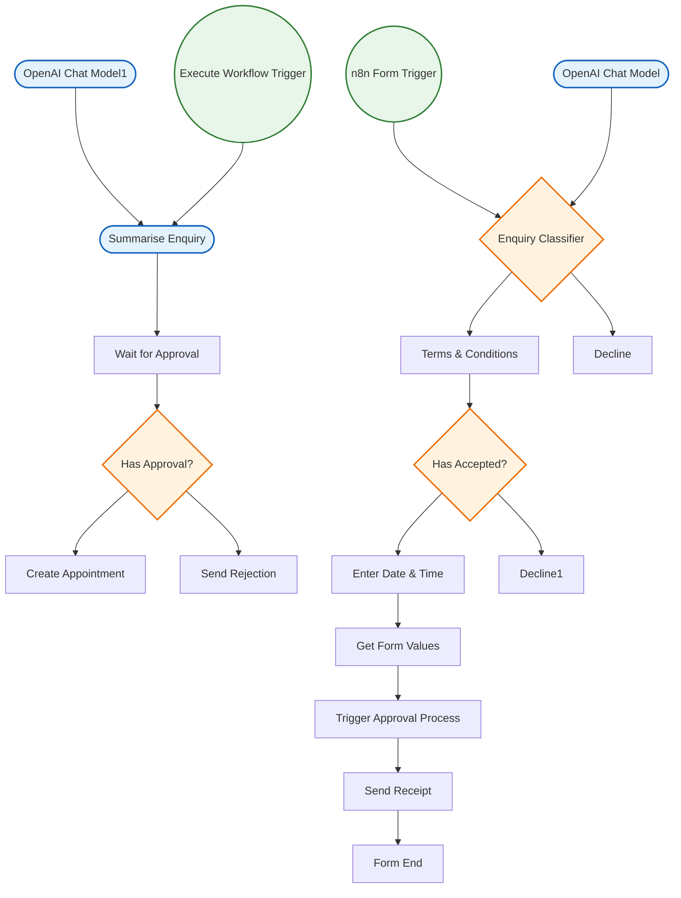

```mermaid
graph TD
    classDef trigger fill:#e8f5e9,stroke:#2e7d32,stroke-width:2px;
    classDef ai fill:#e3f2fd,stroke:#1565c0,stroke-width:2px;
    classDef logic fill:#fff3e0,stroke:#ef6c00,stroke-width:2px;

    n8n_Form_Trigger(("n8n Form Trigger")):::trigger
    Form_End["Form End"]
    Enter_Date___Time["Enter Date & Time"]
    Get_Form_Values["Get Form Values"]
    Terms___Conditions["Terms & Conditions"]
    OpenAI_Chat_Model(["OpenAI Chat Model"]):::ai
    Has_Accepted_{"Has Accepted?"}:::logic
    Send_Receipt["Send Receipt"]
    Wait_for_Approval["Wait for Approval"]
    Has_Approval_{"Has Approval?"}:::logic
    OpenAI_Chat_Model1(["OpenAI Chat Model1"]):::ai
    Create_Appointment["Create Appointment"]
    Send_Rejection["Send Rejection"]
    Decline["Decline"]
    Decline1["Decline1"]
    Trigger_Approval_Process["Trigger Approval Process"]
    Execute_Workflow_Trigger(("Execute Workflow Trigger")):::trigger
    Summarise_Enquiry(["Summarise Enquiry"]):::ai
    Enquiry_Classifier{"Enquiry Classifier"}:::logic

    Send_Receipt --> Form_End
    Has_Accepted_ --> Enter_Date___Time
    Has_Accepted_ --> Decline1
    Has_Approval_ --> Create_Appointment
    Has_Approval_ --> Send_Rejection
    Get_Form_Values --> Trigger_Approval_Process
    n8n_Form_Trigger --> Enquiry_Classifier
    Enter_Date___Time --> Get_Form_Values
    OpenAI_Chat_Model --> Enquiry_Classifier
    Summarise_Enquiry --> Wait_for_Approval
    Wait_for_Approval --> Has_Approval_
    Enquiry_Classifier --> Terms___Conditions
    Enquiry_Classifier --> Decline
    OpenAI_Chat_Model1 --> Summarise_Enquiry
    Terms___Conditions --> Has_Accepted_
    Execute_Workflow_Trigger --> Summarise_Enquiry
    Trigger_Approval_Process --> Send_Receipt
```
