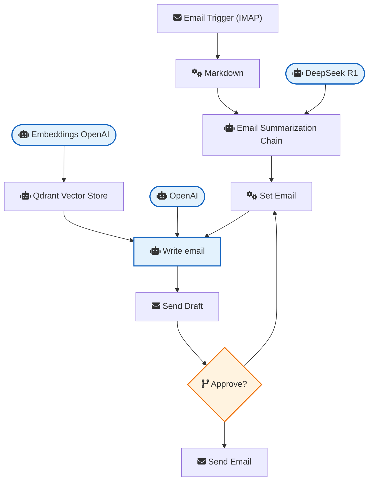

```mermaid
graph TD
    classDef trigger fill:#e8f5e9,stroke:#2e7d32,stroke-width:2px;
    classDef ai fill:#e3f2fd,stroke:#1565c0,stroke-width:2px;
    classDef logic fill:#fff3e0,stroke:#ef6c00,stroke-width:2px;

    Email_Trigger__IMAP_["fas:fa-envelope Email Trigger (IMAP)"]
    Markdown["fas:fa-cogs Markdown"]
    DeepSeek_R1(["fas:fa-robot DeepSeek R1"]):::ai
    Send_Email["fas:fa-envelope Send Email"]
    Qdrant_Vector_Store["fas:fa-robot Qdrant Vector Store"]
    Embeddings_OpenAI(["fas:fa-robot Embeddings OpenAI"]):::ai
    Email_Summarization_Chain["fas:fa-robot Email Summarization Chain"]
    Write_email["fas:fa-robot Write email"]:::ai
    OpenAI(["fas:fa-robot OpenAI"]):::ai
    Set_Email["fas:fa-cogs Set Email"]
    Approve_{"fas:fa-code-branch Approve?"}:::logic
    Send_Draft["fas:fa-envelope Send Draft"]

    OpenAI --> Write_email
    Approve_ --> Send_Email
    Approve_ --> Set_Email
    Markdown --> Email_Summarization_Chain
    Set_Email --> Write_email
    Send_Draft --> Approve_
    DeepSeek_R1 --> Email_Summarization_Chain
    Write_email --> Send_Draft
    Embeddings_OpenAI --> Qdrant_Vector_Store
    Qdrant_Vector_Store --> Write_email
    Email_Trigger__IMAP_ --> Markdown
    Email_Summarization_Chain --> Set_Email
```
