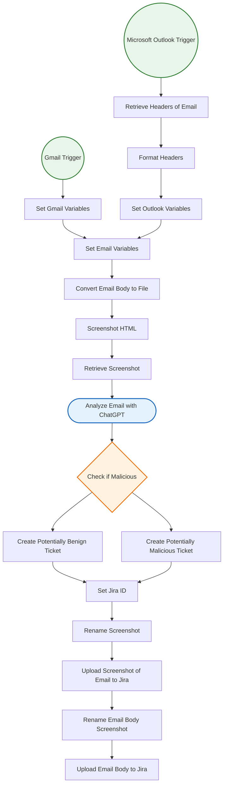

```mermaid
graph TD
    classDef trigger fill:#e8f5e9,stroke:#2e7d32,stroke-width:2px;
    classDef ai fill:#e3f2fd,stroke:#1565c0,stroke-width:2px;
    classDef logic fill:#fff3e0,stroke:#ef6c00,stroke-width:2px;

    Gmail_Trigger(("Gmail Trigger")):::trigger
    Microsoft_Outlook_Trigger(("Microsoft Outlook Trigger")):::trigger
    Screenshot_HTML["Screenshot HTML"]
    Retrieve_Screenshot["Retrieve Screenshot"]
    Set_Outlook_Variables["Set Outlook Variables"]
    Set_Gmail_Variables["Set Gmail Variables"]
    Retrieve_Headers_of_Email["Retrieve Headers of Email"]
    Format_Headers["Format Headers"]
    Analyze_Email_with_ChatGPT(["Analyze Email with ChatGPT"]):::ai
    Create_Potentially_Malicious_Ticket["Create Potentially Malicious Ticket"]
    Create_Potentially_Benign_Ticket["Create Potentially Benign Ticket"]
    Rename_Screenshot["Rename Screenshot"]
    Set_Jira_ID["Set Jira ID"]
    Upload_Screenshot_of_Email_to_Jira["Upload Screenshot of Email to Jira"]
    Upload_Email_Body_to_Jira["Upload Email Body to Jira"]
    Convert_Email_Body_to_File["Convert Email Body to File"]
    Set_Email_Variables["Set Email Variables"]
    Rename_Email_Body_Screenshot["Rename Email Body Screenshot"]
    Check_if_Malicious{"Check if Malicious"}:::logic

    Set_Jira_ID --> Rename_Screenshot
    Gmail_Trigger --> Set_Gmail_Variables
    Format_Headers --> Set_Outlook_Variables
    Screenshot_HTML --> Retrieve_Screenshot
    Rename_Screenshot --> Upload_Screenshot_of_Email_to_Jira
    Check_if_Malicious --> Create_Potentially_Malicious_Ticket
    Check_if_Malicious --> Create_Potentially_Benign_Ticket
    Retrieve_Screenshot --> Analyze_Email_with_ChatGPT
    Set_Email_Variables --> Convert_Email_Body_to_File
    Set_Gmail_Variables --> Set_Email_Variables
    Set_Outlook_Variables --> Set_Email_Variables
    Microsoft_Outlook_Trigger --> Retrieve_Headers_of_Email
    Retrieve_Headers_of_Email --> Format_Headers
    Analyze_Email_with_ChatGPT --> Check_if_Malicious
    Convert_Email_Body_to_File --> Screenshot_HTML
    Rename_Email_Body_Screenshot --> Upload_Email_Body_to_Jira
    Create_Potentially_Benign_Ticket --> Set_Jira_ID
    Upload_Screenshot_of_Email_to_Jira --> Rename_Email_Body_Screenshot
    Create_Potentially_Malicious_Ticket --> Set_Jira_ID
```
