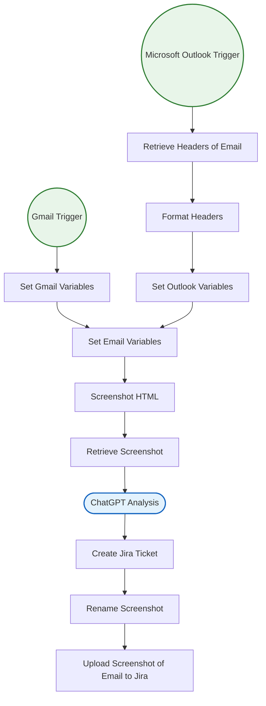

```mermaid
graph TD
    classDef trigger fill:#e8f5e9,stroke:#2e7d32,stroke-width:2px;
    classDef ai fill:#e3f2fd,stroke:#1565c0,stroke-width:2px;
    classDef logic fill:#fff3e0,stroke:#ef6c00,stroke-width:2px;

    Gmail_Trigger(("Gmail Trigger")):::trigger
    Microsoft_Outlook_Trigger(("Microsoft Outlook Trigger")):::trigger
    Screenshot_HTML["Screenshot HTML"]
    Retrieve_Screenshot["Retrieve Screenshot"]
    Set_Outlook_Variables["Set Outlook Variables"]
    Set_Gmail_Variables["Set Gmail Variables"]
    Retrieve_Headers_of_Email["Retrieve Headers of Email"]
    Format_Headers["Format Headers"]
    Set_Email_Variables["Set Email Variables"]
    ChatGPT_Analysis(["ChatGPT Analysis"]):::ai
    Create_Jira_Ticket["Create Jira Ticket"]
    Rename_Screenshot["Rename Screenshot"]
    Upload_Screenshot_of_Email_to_Jira["Upload Screenshot of Email to Jira"]

    Gmail_Trigger --> Set_Gmail_Variables
    Format_Headers --> Set_Outlook_Variables
    Screenshot_HTML --> Retrieve_Screenshot
    ChatGPT_Analysis --> Create_Jira_Ticket
    Rename_Screenshot --> Upload_Screenshot_of_Email_to_Jira
    Create_Jira_Ticket --> Rename_Screenshot
    Retrieve_Screenshot --> ChatGPT_Analysis
    Set_Email_Variables --> Screenshot_HTML
    Set_Gmail_Variables --> Set_Email_Variables
    Set_Outlook_Variables --> Set_Email_Variables
    Microsoft_Outlook_Trigger --> Retrieve_Headers_of_Email
    Retrieve_Headers_of_Email --> Format_Headers
```
