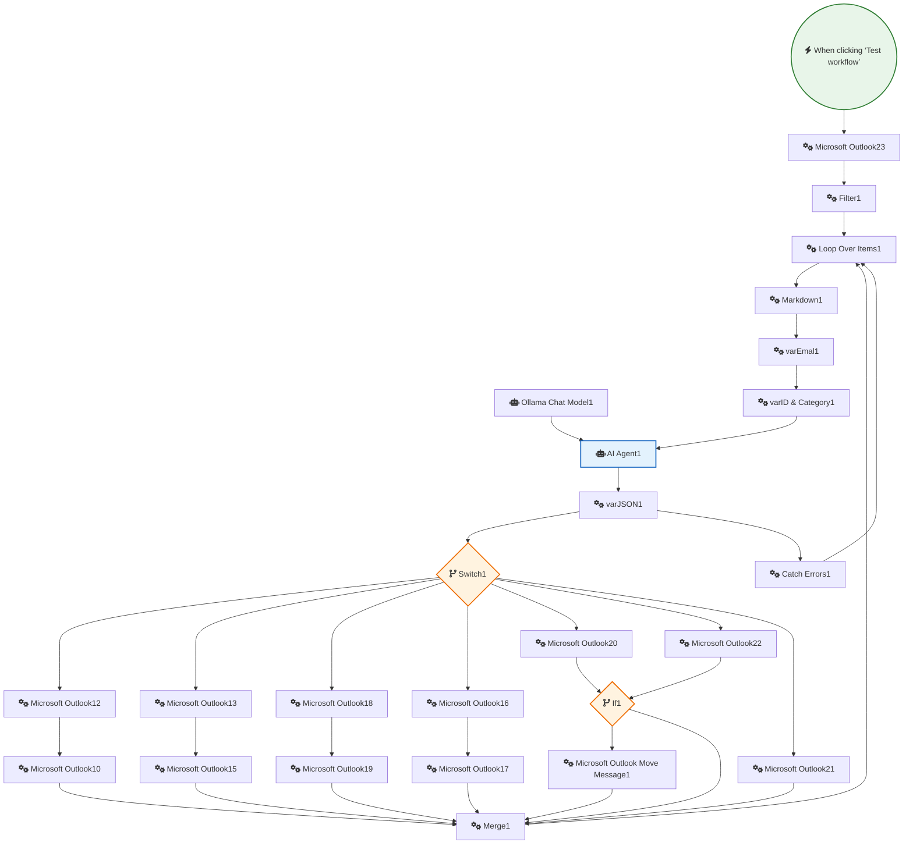

```mermaid
graph TD
    classDef trigger fill:#e8f5e9,stroke:#2e7d32,stroke-width:2px;
    classDef ai fill:#e3f2fd,stroke:#1565c0,stroke-width:2px;
    classDef logic fill:#fff3e0,stroke:#ef6c00,stroke-width:2px;

    When_clicking__Test_workflow_(("fas:fa-bolt When clicking ‘Test workflow’")):::trigger
    Ollama_Chat_Model1["fas:fa-robot Ollama Chat Model1"]
    Microsoft_Outlook10["fas:fa-cogs Microsoft Outlook10"]
    Microsoft_Outlook12["fas:fa-cogs Microsoft Outlook12"]
    Loop_Over_Items1["fas:fa-cogs Loop Over Items1"]
    Microsoft_Outlook13["fas:fa-cogs Microsoft Outlook13"]
    Microsoft_Outlook15["fas:fa-cogs Microsoft Outlook15"]
    Microsoft_Outlook16["fas:fa-cogs Microsoft Outlook16"]
    Microsoft_Outlook17["fas:fa-cogs Microsoft Outlook17"]
    Microsoft_Outlook18["fas:fa-cogs Microsoft Outlook18"]
    Microsoft_Outlook19["fas:fa-cogs Microsoft Outlook19"]
    Markdown1["fas:fa-cogs Markdown1"]
    varEmal1["fas:fa-cogs varEmal1"]
    Microsoft_Outlook20["fas:fa-cogs Microsoft Outlook20"]
    Microsoft_Outlook21["fas:fa-cogs Microsoft Outlook21"]
    Filter1["fas:fa-cogs Filter1"]
    If1{"fas:fa-code-branch If1"}:::logic
    Microsoft_Outlook22["fas:fa-cogs Microsoft Outlook22"]
    Catch_Errors1["fas:fa-cogs Catch Errors1"]
    varJSON1["fas:fa-cogs varJSON1"]
    Microsoft_Outlook23["fas:fa-cogs Microsoft Outlook23"]
    varID___Category1["fas:fa-cogs varID & Category1"]
    Microsoft_Outlook_Move_Message1["fas:fa-cogs Microsoft Outlook Move Message1"]
    AI_Agent1["fas:fa-robot AI Agent1"]:::ai
    Merge1["fas:fa-cogs Merge1"]
    Switch1{"fas:fa-code-branch Switch1"}:::logic

    If1 --> Microsoft_Outlook_Move_Message1
    If1 --> Merge1
    Merge1 --> Loop_Over_Items1
    Filter1 --> Loop_Over_Items1
    Switch1 --> Microsoft_Outlook12
    Switch1 --> Microsoft_Outlook13
    Switch1 --> Microsoft_Outlook18
    Switch1 --> Microsoft_Outlook16
    Switch1 --> Microsoft_Outlook20
    Switch1 --> Microsoft_Outlook22
    Switch1 --> Microsoft_Outlook21
    varEmal1 --> varID___Category1
    varJSON1 --> Switch1
    varJSON1 --> Catch_Errors1
    AI_Agent1 --> varJSON1
    Markdown1 --> varEmal1
    Catch_Errors1 --> Loop_Over_Items1
    Loop_Over_Items1 --> Markdown1
    varID___Category1 --> AI_Agent1
    Ollama_Chat_Model1 --> AI_Agent1
    Microsoft_Outlook10 --> Merge1
    Microsoft_Outlook12 --> Microsoft_Outlook10
    Microsoft_Outlook13 --> Microsoft_Outlook15
    Microsoft_Outlook15 --> Merge1
    Microsoft_Outlook16 --> Microsoft_Outlook17
    Microsoft_Outlook17 --> Merge1
    Microsoft_Outlook18 --> Microsoft_Outlook19
    Microsoft_Outlook19 --> Merge1
    Microsoft_Outlook20 --> If1
    Microsoft_Outlook21 --> Merge1
    Microsoft_Outlook22 --> If1
    Microsoft_Outlook23 --> Filter1
    Microsoft_Outlook_Move_Message1 --> Merge1
    When_clicking__Test_workflow_ --> Microsoft_Outlook23
```
