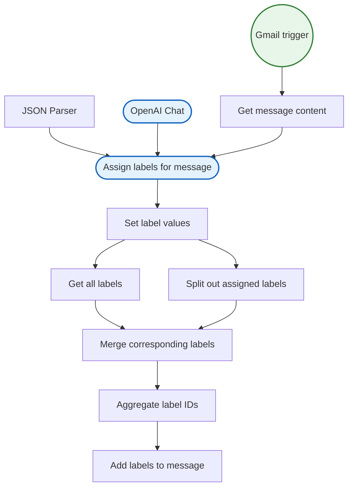

```mermaid
graph TD
    classDef trigger fill:#e8f5e9,stroke:#2e7d32,stroke-width:2px;
    classDef ai fill:#e3f2fd,stroke:#1565c0,stroke-width:2px;
    classDef logic fill:#fff3e0,stroke:#ef6c00,stroke-width:2px;

    Gmail_trigger(("Gmail trigger")):::trigger
    Get_message_content["Get message content"]
    Set_label_values["Set label values"]
    Get_all_labels["Get all labels"]
    Split_out_assigned_labels["Split out assigned labels"]
    Merge_corresponding_labels["Merge corresponding labels"]
    Aggregate_label_IDs["Aggregate label IDs"]
    Add_labels_to_message["Add labels to message"]
    Assign_labels_for_message(["Assign labels for message"]):::ai
    JSON_Parser["JSON Parser"]
    OpenAI_Chat(["OpenAI Chat"]):::ai

    JSON_Parser --> Assign_labels_for_message
    OpenAI_Chat --> Assign_labels_for_message
    Gmail_trigger --> Get_message_content
    Get_all_labels --> Merge_corresponding_labels
    Set_label_values --> Get_all_labels
    Set_label_values --> Split_out_assigned_labels
    Aggregate_label_IDs --> Add_labels_to_message
    Get_message_content --> Assign_labels_for_message
    Assign_labels_for_message --> Set_label_values
    Split_out_assigned_labels --> Merge_corresponding_labels
    Merge_corresponding_labels --> Aggregate_label_IDs
```
