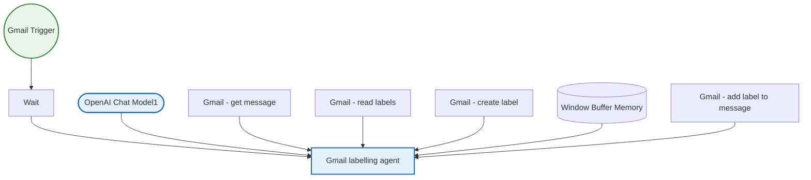

```mermaid
graph TD
    classDef trigger fill:#e8f5e9,stroke:#2e7d32,stroke-width:2px;
    classDef ai fill:#e3f2fd,stroke:#1565c0,stroke-width:2px;
    classDef logic fill:#fff3e0,stroke:#ef6c00,stroke-width:2px;

    Gmail_Trigger(("Gmail Trigger")):::trigger
    OpenAI_Chat_Model1(["OpenAI Chat Model1"]):::ai
    Gmail___read_labels["Gmail - read labels"]
    Gmail___get_message["Gmail - get message"]
    Gmail___add_label_to_message["Gmail - add label to message"]
    Gmail___create_label["Gmail - create label"]
    Gmail_labelling_agent["Gmail labelling agent"]:::ai
    Window_Buffer_Memory[("Window Buffer Memory")]
    Wait["Wait"]

    Wait --> Gmail_labelling_agent
    Gmail_Trigger --> Wait
    OpenAI_Chat_Model1 --> Gmail_labelling_agent
    Gmail___get_message --> Gmail_labelling_agent
    Gmail___read_labels --> Gmail_labelling_agent
    Gmail___create_label --> Gmail_labelling_agent
    Window_Buffer_Memory --> Gmail_labelling_agent
    Gmail___add_label_to_message --> Gmail_labelling_agent
```
