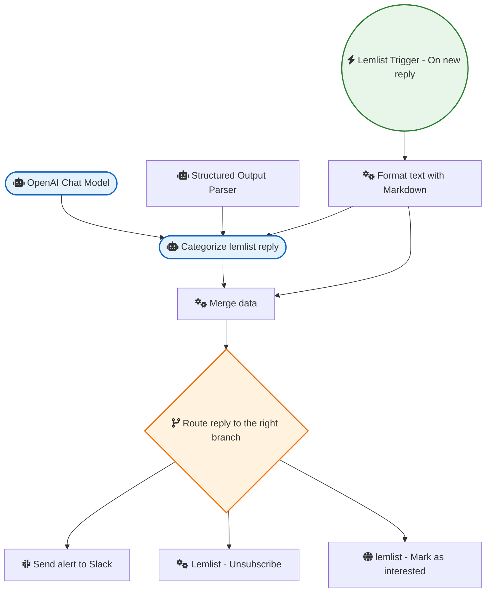

```mermaid
graph TD
    classDef trigger fill:#e8f5e9,stroke:#2e7d32,stroke-width:2px;
    classDef ai fill:#e3f2fd,stroke:#1565c0,stroke-width:2px;
    classDef logic fill:#fff3e0,stroke:#ef6c00,stroke-width:2px;

    Format_text_with_Markdown["fas:fa-cogs Format text with Markdown"]
    Lemlist_Trigger___On_new_reply(("fas:fa-bolt Lemlist Trigger - On new reply")):::trigger
    OpenAI_Chat_Model(["fas:fa-robot OpenAI Chat Model"]):::ai
    Structured_Output_Parser["fas:fa-robot Structured Output Parser"]
    Send_alert_to_Slack["fab:fa-slack Send alert to Slack"]
    Lemlist___Unsubscribe["fas:fa-cogs Lemlist - Unsubscribe"]
    lemlist___Mark_as_interested["fas:fa-globe lemlist - Mark as interested"]
    Categorize_lemlist_reply(["fas:fa-robot Categorize lemlist reply"]):::ai
    Merge_data["fas:fa-cogs Merge data"]
    Route_reply_to_the_right_branch{"fas:fa-code-branch Route reply to the right branch"}:::logic

    Merge_data --> Route_reply_to_the_right_branch
    OpenAI_Chat_Model --> Categorize_lemlist_reply
    Categorize_lemlist_reply --> Merge_data
    Structured_Output_Parser --> Categorize_lemlist_reply
    Format_text_with_Markdown --> Merge_data
    Format_text_with_Markdown --> Categorize_lemlist_reply
    Lemlist_Trigger___On_new_reply --> Format_text_with_Markdown
    Route_reply_to_the_right_branch --> Send_alert_to_Slack
    Route_reply_to_the_right_branch --> Lemlist___Unsubscribe
    Route_reply_to_the_right_branch --> lemlist___Mark_as_interested
```
