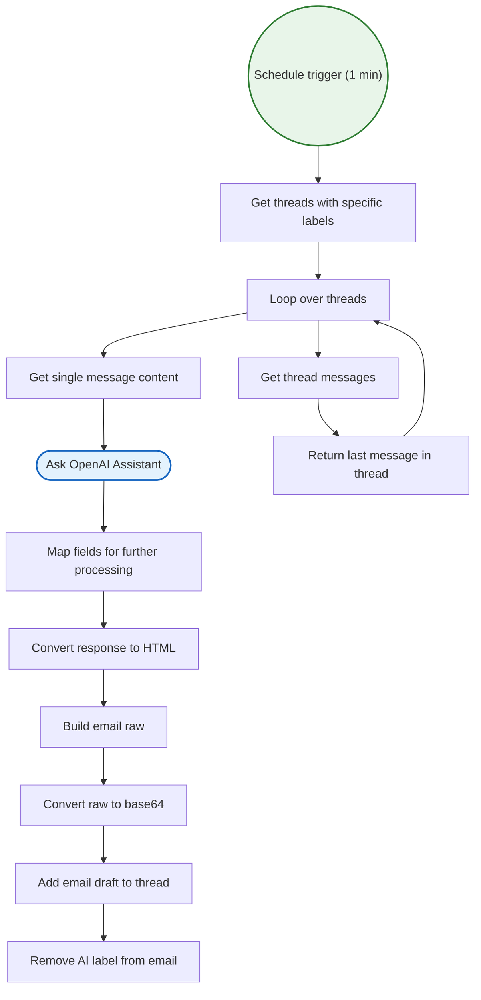

```mermaid
graph TD
    classDef trigger fill:#e8f5e9,stroke:#2e7d32,stroke-width:2px;
    classDef ai fill:#e3f2fd,stroke:#1565c0,stroke-width:2px;
    classDef logic fill:#fff3e0,stroke:#ef6c00,stroke-width:2px;

    Convert_raw_to_base64["Convert raw to base64"]
    Add_email_draft_to_thread["Add email draft to thread"]
    Remove_AI_label_from_email["Remove AI label from email"]
    Schedule_trigger__1_min_(("Schedule trigger (1 min)")):::trigger
    Map_fields_for_further_processing["Map fields for further processing"]
    Convert_response_to_HTML["Convert response to HTML"]
    Build_email_raw["Build email raw"]
    Get_threads_with_specific_labels["Get threads with specific labels"]
    Ask_OpenAI_Assistant(["Ask OpenAI Assistant"]):::ai
    Loop_over_threads["Loop over threads"]
    Get_thread_messages["Get thread messages"]
    Return_last_message_in_thread["Return last message in thread"]
    Get_single_message_content["Get single message content"]

    Build_email_raw --> Convert_raw_to_base64
    Loop_over_threads --> Get_single_message_content
    Loop_over_threads --> Get_thread_messages
    Get_thread_messages --> Return_last_message_in_thread
    Ask_OpenAI_Assistant --> Map_fields_for_further_processing
    Convert_raw_to_base64 --> Add_email_draft_to_thread
    Convert_response_to_HTML --> Build_email_raw
    Schedule_trigger__1_min_ --> Get_threads_with_specific_labels
    Add_email_draft_to_thread --> Remove_AI_label_from_email
    Get_single_message_content --> Ask_OpenAI_Assistant
    Return_last_message_in_thread --> Loop_over_threads
    Get_threads_with_specific_labels --> Loop_over_threads
    Map_fields_for_further_processing --> Convert_response_to_HTML
```
