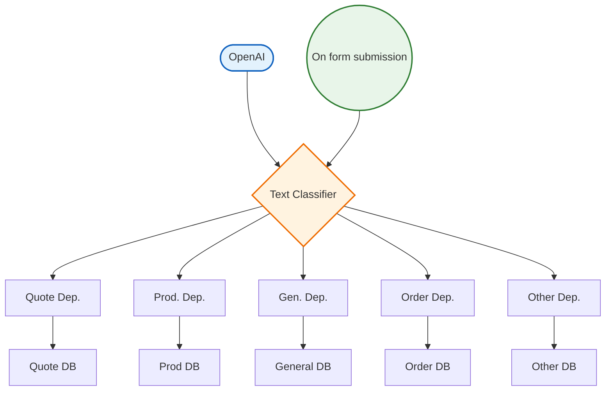

```mermaid
graph TD
    classDef trigger fill:#e8f5e9,stroke:#2e7d32,stroke-width:2px;
    classDef ai fill:#e3f2fd,stroke:#1565c0,stroke-width:2px;
    classDef logic fill:#fff3e0,stroke:#ef6c00,stroke-width:2px;

    On_form_submission(("On form submission")):::trigger
    Text_Classifier{"Text Classifier"}:::logic
    OpenAI(["OpenAI"]):::ai
    Prod__Dep_["Prod. Dep."]
    Quote_Dep_["Quote Dep."]
    Gen__Dep_["Gen. Dep."]
    Order_Dep_["Order Dep."]
    Other_Dep_["Other Dep."]
    Quote_DB["Quote DB"]
    Prod_DB["Prod DB"]
    General_DB["General DB"]
    Order_DB["Order DB"]
    Other_DB["Other DB"]

    OpenAI --> Text_Classifier
    Gen__Dep_ --> General_DB
    Order_Dep_ --> Order_DB
    Other_Dep_ --> Other_DB
    Prod__Dep_ --> Prod_DB
    Quote_Dep_ --> Quote_DB
    Text_Classifier --> Quote_Dep_
    Text_Classifier --> Prod__Dep_
    Text_Classifier --> Gen__Dep_
    Text_Classifier --> Order_Dep_
    Text_Classifier --> Other_Dep_
    On_form_submission --> Text_Classifier
```
