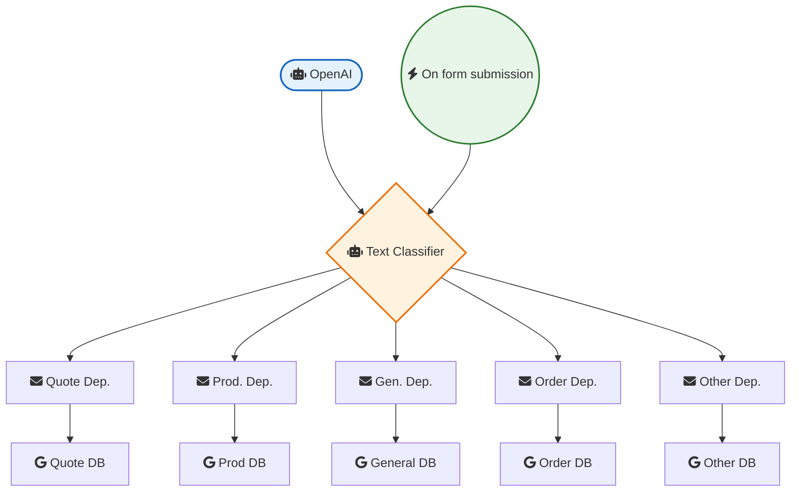

```mermaid
graph TD
    classDef trigger fill:#e8f5e9,stroke:#2e7d32,stroke-width:2px;
    classDef ai fill:#e3f2fd,stroke:#1565c0,stroke-width:2px;
    classDef logic fill:#fff3e0,stroke:#ef6c00,stroke-width:2px;

    On_form_submission(("fas:fa-bolt On form submission")):::trigger
    Text_Classifier{"fas:fa-robot Text Classifier"}:::logic
    OpenAI(["fas:fa-robot OpenAI"]):::ai
    Prod__Dep_["fas:fa-envelope Prod. Dep."]
    Quote_Dep_["fas:fa-envelope Quote Dep."]
    Gen__Dep_["fas:fa-envelope Gen. Dep."]
    Order_Dep_["fas:fa-envelope Order Dep."]
    Other_Dep_["fas:fa-envelope Other Dep."]
    Quote_DB["fab:fa-google Quote DB"]
    Prod_DB["fab:fa-google Prod DB"]
    General_DB["fab:fa-google General DB"]
    Order_DB["fab:fa-google Order DB"]
    Other_DB["fab:fa-google Other DB"]

    OpenAI --> Text_Classifier
    Gen__Dep_ --> General_DB
    Order_Dep_ --> Order_DB
    Other_Dep_ --> Other_DB
    Prod__Dep_ --> Prod_DB
    Quote_Dep_ --> Quote_DB
    Text_Classifier --> Quote_Dep_
    Text_Classifier --> Prod__Dep_
    Text_Classifier --> Gen__Dep_
    Text_Classifier --> Order_Dep_
    Text_Classifier --> Other_Dep_
    On_form_submission --> Text_Classifier
```
