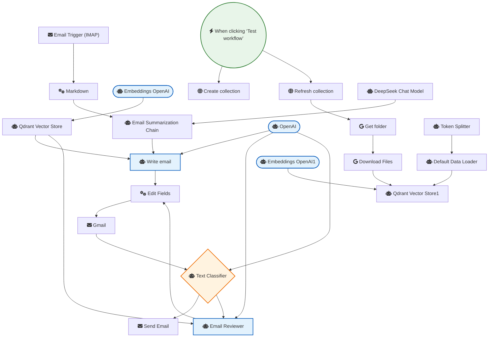

```mermaid
graph TD
    classDef trigger fill:#e8f5e9,stroke:#2e7d32,stroke-width:2px;
    classDef ai fill:#e3f2fd,stroke:#1565c0,stroke-width:2px;
    classDef logic fill:#fff3e0,stroke:#ef6c00,stroke-width:2px;

    Email_Trigger__IMAP_["fas:fa-envelope Email Trigger (IMAP)"]
    Markdown["fas:fa-cogs Markdown"]
    Send_Email["fas:fa-envelope Send Email"]
    Qdrant_Vector_Store["fas:fa-robot Qdrant Vector Store"]
    Embeddings_OpenAI(["fas:fa-robot Embeddings OpenAI"]):::ai
    Email_Summarization_Chain["fas:fa-robot Email Summarization Chain"]
    Write_email["fas:fa-robot Write email"]:::ai
    OpenAI(["fas:fa-robot OpenAI"]):::ai
    Gmail["fas:fa-envelope Gmail"]
    Text_Classifier{"fas:fa-robot Text Classifier"}:::logic
    Edit_Fields["fas:fa-cogs Edit Fields"]
    When_clicking__Test_workflow_(("fas:fa-bolt When clicking ‘Test workflow’")):::trigger
    Create_collection["fas:fa-globe Create collection"]
    Refresh_collection["fas:fa-globe Refresh collection"]
    Get_folder["fab:fa-google Get folder"]
    Download_Files["fab:fa-google Download Files"]
    Default_Data_Loader["fas:fa-robot Default Data Loader"]
    Token_Splitter["fas:fa-robot Token Splitter"]
    Qdrant_Vector_Store1["fas:fa-robot Qdrant Vector Store1"]
    Embeddings_OpenAI1(["fas:fa-robot Embeddings OpenAI1"]):::ai
    DeepSeek_Chat_Model["fas:fa-robot DeepSeek Chat Model"]
    Email_Reviewer["fas:fa-robot Email Reviewer"]:::ai

    Gmail --> Text_Classifier
    OpenAI --> Write_email
    OpenAI --> Email_Reviewer
    OpenAI --> Text_Classifier
    Markdown --> Email_Summarization_Chain
    Get_folder --> Download_Files
    Edit_Fields --> Gmail
    Write_email --> Edit_Fields
    Download_Files --> Qdrant_Vector_Store1
    Email_Reviewer --> Edit_Fields
    Token_Splitter --> Default_Data_Loader
    Text_Classifier --> Send_Email
    Text_Classifier --> Email_Reviewer
    Embeddings_OpenAI --> Qdrant_Vector_Store
    Embeddings_OpenAI1 --> Qdrant_Vector_Store1
    Refresh_collection --> Get_folder
    DeepSeek_Chat_Model --> Email_Summarization_Chain
    Default_Data_Loader --> Qdrant_Vector_Store1
    Qdrant_Vector_Store --> Write_email
    Qdrant_Vector_Store --> Email_Reviewer
    Email_Trigger__IMAP_ --> Markdown
    Email_Summarization_Chain --> Write_email
    When_clicking__Test_workflow_ --> Create_collection
    When_clicking__Test_workflow_ --> Refresh_collection
```
