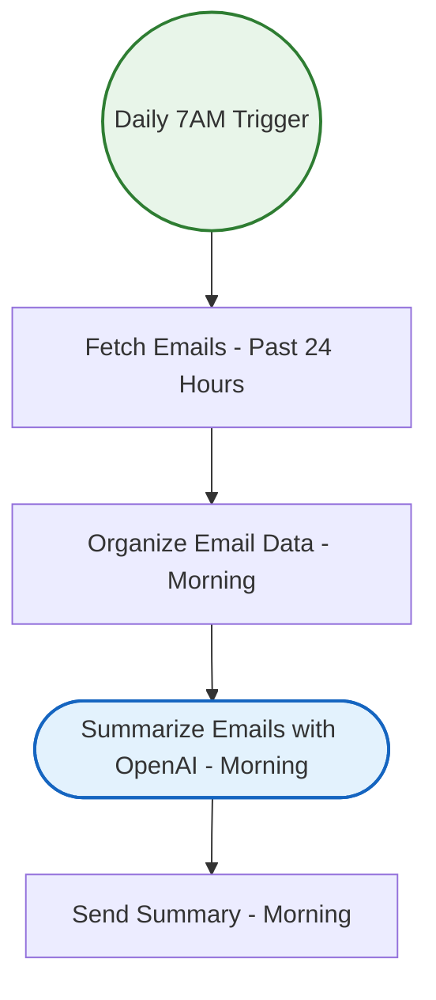

```mermaid
graph TD
    classDef trigger fill:#e8f5e9,stroke:#2e7d32,stroke-width:2px;
    classDef ai fill:#e3f2fd,stroke:#1565c0,stroke-width:2px;
    classDef logic fill:#fff3e0,stroke:#ef6c00,stroke-width:2px;

    Daily_7AM_Trigger(("Daily 7AM Trigger")):::trigger
    Fetch_Emails___Past_24_Hours["Fetch Emails - Past 24 Hours"]
    Organize_Email_Data___Morning["Organize Email Data - Morning"]
    Summarize_Emails_with_OpenAI___Morning(["Summarize Emails with OpenAI - Morning"]):::ai
    Send_Summary___Morning["Send Summary - Morning"]

    Daily_7AM_Trigger --> Fetch_Emails___Past_24_Hours
    Fetch_Emails___Past_24_Hours --> Organize_Email_Data___Morning
    Organize_Email_Data___Morning --> Summarize_Emails_with_OpenAI___Morning
    Summarize_Emails_with_OpenAI___Morning --> Send_Summary___Morning
```
