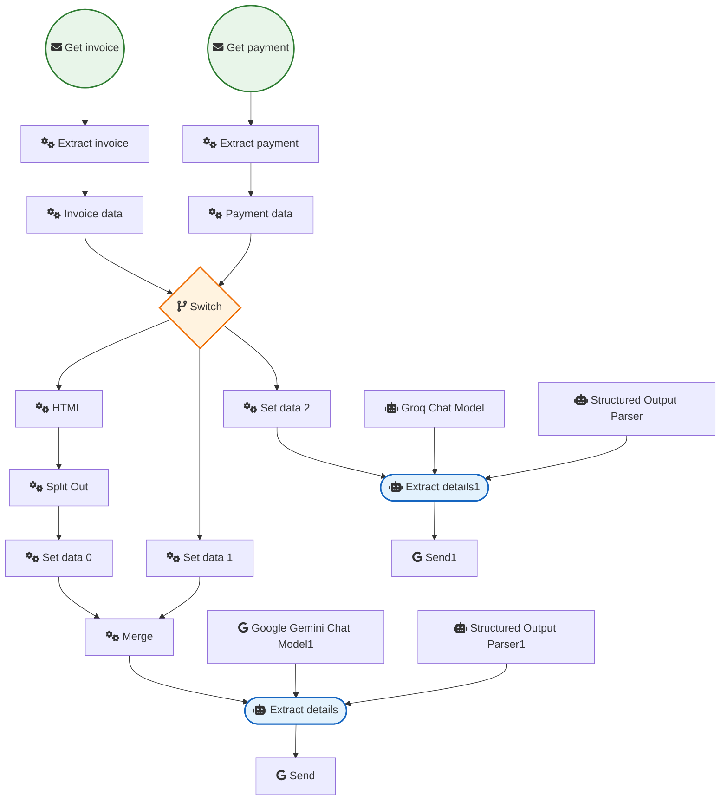

```mermaid
graph TD
    classDef trigger fill:#e8f5e9,stroke:#2e7d32,stroke-width:2px;
    classDef ai fill:#e3f2fd,stroke:#1565c0,stroke-width:2px;
    classDef logic fill:#fff3e0,stroke:#ef6c00,stroke-width:2px;

    Get_invoice(("fas:fa-envelope Get invoice")):::trigger
    Get_payment(("fas:fa-envelope Get payment")):::trigger
    Extract_invoice["fas:fa-cogs Extract invoice"]
    Extract_payment["fas:fa-cogs Extract payment"]
    HTML["fas:fa-cogs HTML"]
    Split_Out["fas:fa-cogs Split Out"]
    Structured_Output_Parser1["fas:fa-robot Structured Output Parser1"]
    Google_Gemini_Chat_Model1["fab:fa-google Google Gemini Chat Model1"]
    Send["fab:fa-google Send"]
    Set_data_0["fas:fa-cogs Set data 0"]
    Set_data_1["fas:fa-cogs Set data 1"]
    Set_data_2["fas:fa-cogs Set data 2"]
    Invoice_data["fas:fa-cogs Invoice data"]
    Payment_data["fas:fa-cogs Payment data"]
    Switch{"fas:fa-code-branch Switch"}:::logic
    Groq_Chat_Model["fas:fa-robot Groq Chat Model"]
    Structured_Output_Parser["fas:fa-robot Structured Output Parser"]
    Send1["fab:fa-google Send1"]
    Extract_details1(["fas:fa-robot Extract details1"]):::ai
    Merge["fas:fa-cogs Merge"]
    Extract_details(["fas:fa-robot Extract details"]):::ai

    HTML --> Split_Out
    Merge --> Extract_details
    Switch --> HTML
    Switch --> Set_data_1
    Switch --> Set_data_2
    Split_Out --> Set_data_0
    Set_data_0 --> Merge
    Set_data_1 --> Merge
    Set_data_2 --> Extract_details1
    Get_invoice --> Extract_invoice
    Get_payment --> Extract_payment
    Invoice_data --> Switch
    Payment_data --> Switch
    Extract_details --> Send
    Extract_invoice --> Invoice_data
    Extract_payment --> Payment_data
    Groq_Chat_Model --> Extract_details1
    Extract_details1 --> Send1
    Structured_Output_Parser --> Extract_details1
    Google_Gemini_Chat_Model1 --> Extract_details
    Structured_Output_Parser1 --> Extract_details
```
