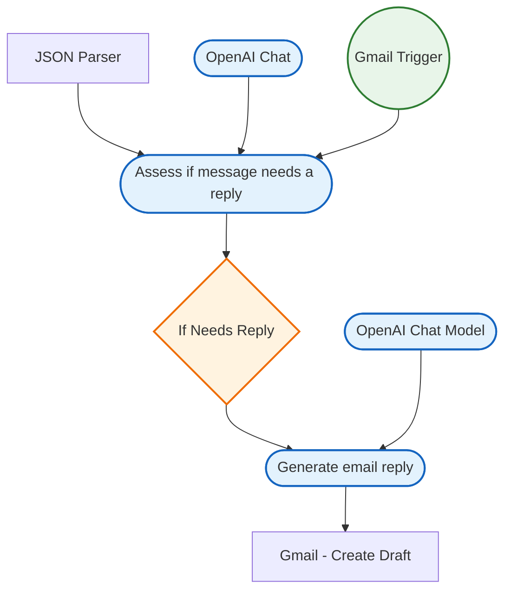

```mermaid
graph TD
    classDef trigger fill:#e8f5e9,stroke:#2e7d32,stroke-width:2px;
    classDef ai fill:#e3f2fd,stroke:#1565c0,stroke-width:2px;
    classDef logic fill:#fff3e0,stroke:#ef6c00,stroke-width:2px;

    Gmail_Trigger(("Gmail Trigger")):::trigger
    If_Needs_Reply{"If Needs Reply"}:::logic
    JSON_Parser["JSON Parser"]
    OpenAI_Chat(["OpenAI Chat"]):::ai
    OpenAI_Chat_Model(["OpenAI Chat Model"]):::ai
    Gmail___Create_Draft["Gmail - Create Draft"]
    Assess_if_message_needs_a_reply(["Assess if message needs a reply"]):::ai
    Generate_email_reply(["Generate email reply"]):::ai

    JSON_Parser --> Assess_if_message_needs_a_reply
    OpenAI_Chat --> Assess_if_message_needs_a_reply
    Gmail_Trigger --> Assess_if_message_needs_a_reply
    If_Needs_Reply --> Generate_email_reply
    OpenAI_Chat_Model --> Generate_email_reply
    Generate_email_reply --> Gmail___Create_Draft
    Assess_if_message_needs_a_reply --> If_Needs_Reply
```
