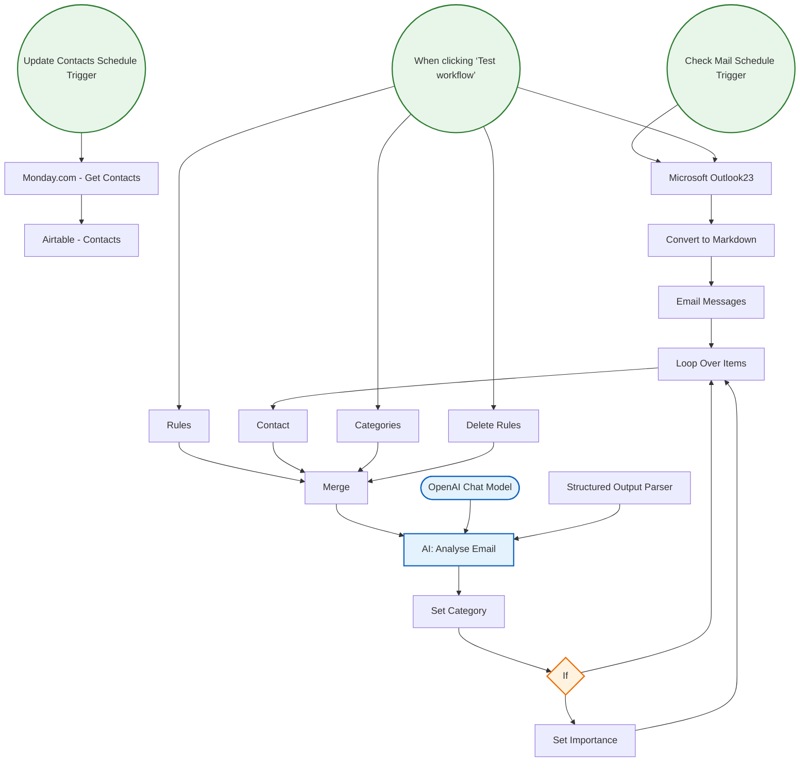

```mermaid
graph TD
    classDef trigger fill:#e8f5e9,stroke:#2e7d32,stroke-width:2px;
    classDef ai fill:#e3f2fd,stroke:#1565c0,stroke-width:2px;
    classDef logic fill:#fff3e0,stroke:#ef6c00,stroke-width:2px;

    When_clicking__Test_workflow_(("When clicking ‘Test workflow’")):::trigger
    Microsoft_Outlook23["Microsoft Outlook23"]
    OpenAI_Chat_Model(["OpenAI Chat Model"]):::ai
    Set_Category["Set Category"]
    Structured_Output_Parser["Structured Output Parser"]
    If{"If"}:::logic
    Set_Importance["Set Importance"]
    AI__Analyse_Email["AI: Analyse Email"]:::ai
    Check_Mail_Schedule_Trigger(("Check Mail Schedule Trigger")):::trigger
    Update_Contacts_Schedule_Trigger(("Update Contacts Schedule Trigger")):::trigger
    Monday_com___Get_Contacts["Monday.com - Get Contacts"]
    Airtable___Contacts["Airtable - Contacts"]
    Convert_to_Markdown["Convert to Markdown"]
    Email_Messages["Email Messages"]
    Rules["Rules"]
    Categories["Categories"]
    Delete_Rules["Delete Rules"]
    Contact["Contact"]
    Loop_Over_Items["Loop Over Items"]
    Merge["Merge"]

    If --> Set_Importance
    If --> Loop_Over_Items
    Merge --> AI__Analyse_Email
    Rules --> Merge
    Contact --> Merge
    Categories --> Merge
    Delete_Rules --> Merge
    Set_Category --> If
    Email_Messages --> Loop_Over_Items
    Set_Importance --> Loop_Over_Items
    Loop_Over_Items --> Contact
    AI__Analyse_Email --> Set_Category
    OpenAI_Chat_Model --> AI__Analyse_Email
    Convert_to_Markdown --> Email_Messages
    Microsoft_Outlook23 --> Convert_to_Markdown
    Structured_Output_Parser --> AI__Analyse_Email
    Monday_com___Get_Contacts --> Airtable___Contacts
    Check_Mail_Schedule_Trigger --> Microsoft_Outlook23
    Update_Contacts_Schedule_Trigger --> Monday_com___Get_Contacts
    When_clicking__Test_workflow_ --> Microsoft_Outlook23
    When_clicking__Test_workflow_ --> Rules
    When_clicking__Test_workflow_ --> Categories
    When_clicking__Test_workflow_ --> Delete_Rules
```
