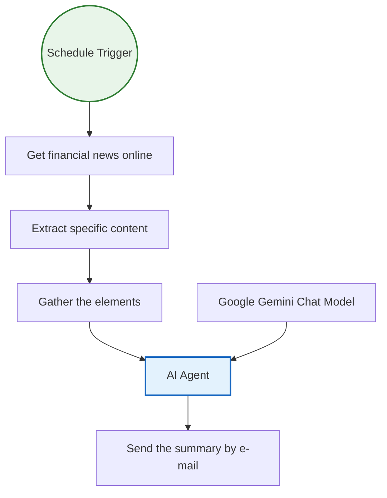

```mermaid
graph TD
    classDef trigger fill:#e8f5e9,stroke:#2e7d32,stroke-width:2px;
    classDef ai fill:#e3f2fd,stroke:#1565c0,stroke-width:2px;
    classDef logic fill:#fff3e0,stroke:#ef6c00,stroke-width:2px;

    Extract_specific_content["Extract specific content"]
    Get_financial_news_online["Get financial news online"]
    Schedule_Trigger(("Schedule Trigger")):::trigger
    Google_Gemini_Chat_Model["Google Gemini Chat Model"]
    Gather_the_elements["Gather the elements"]
    AI_Agent["AI Agent"]:::ai
    Send_the_summary_by_e_mail["Send the summary by e-mail"]

    AI_Agent --> Send_the_summary_by_e_mail
    Schedule_Trigger --> Get_financial_news_online
    Gather_the_elements --> AI_Agent
    Extract_specific_content --> Gather_the_elements
    Google_Gemini_Chat_Model --> AI_Agent
    Get_financial_news_online --> Extract_specific_content
```
