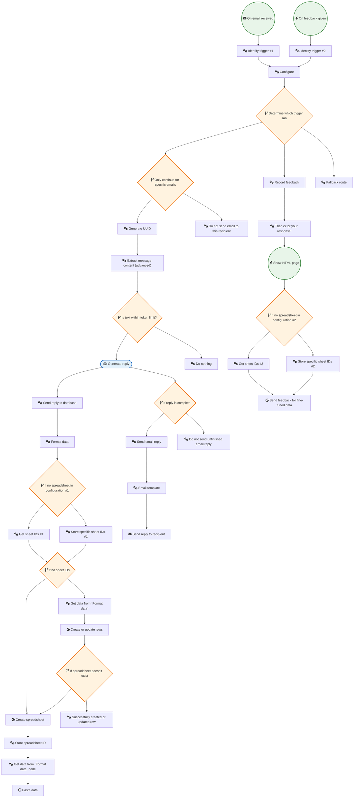

```mermaid
graph TD
    classDef trigger fill:#e8f5e9,stroke:#2e7d32,stroke-width:2px;
    classDef ai fill:#e3f2fd,stroke:#1565c0,stroke-width:2px;
    classDef logic fill:#fff3e0,stroke:#ef6c00,stroke-width:2px;

    Generate_reply(["fas:fa-robot Generate reply"]):::ai
    On_email_received(("fas:fa-envelope On email received")):::trigger
    Only_continue_for_specific_emails{"fas:fa-code-branch Only continue for specific emails"}:::logic
    Configure["fas:fa-cogs Configure"]
    Send_reply_to_recipient["fas:fa-envelope Send reply to recipient"]
    Generate_UUID["fas:fa-cogs Generate UUID"]
    Thanks_for_your_response_["fas:fa-cogs Thanks for your response!"]
    Extract_message_content__advanced_["fas:fa-cogs Extract message content (advanced)"]
    If_spreadsheet_doesn_t_exist{"fas:fa-code-branch If spreadsheet doesn't exist"}:::logic
    Successfully_created_or_updated_row["fas:fa-cogs Successfully created or updated row"]
    Create_spreadsheet["fab:fa-google Create spreadsheet"]
    Store_spreadsheet_ID["fas:fa-cogs Store spreadsheet ID"]
    Paste_data["fab:fa-google Paste data"]
    If_no_sheet_IDs{"fas:fa-code-branch If no sheet IDs"}:::logic
    Create_or_update_rows["fab:fa-google Create or update rows"]
    Get_data_from__Format_data_["fas:fa-cogs Get data from `Format data`"]
    Get_data_from__Format_data__node["fas:fa-cogs Get data from `Format data` node"]
    Format_data["fas:fa-cogs Format data"]
    Send_email_reply["fas:fa-cogs Send email reply"]
    On_feedback_given(("fas:fa-bolt On feedback given")):::trigger
    Send_feedback_for_fine_tuned_data["fab:fa-google Send feedback for fine-tuned data"]
    Show_HTML_page(("fas:fa-bolt Show HTML page")):::trigger
    Get_sheet_IDs__1["fas:fa-cogs Get sheet IDs #1"]
    If_no_spreadsheet_in_configuration__2{"fas:fa-code-branch If no spreadsheet in configuration #2"}:::logic
    Store_specific_sheet_IDs__2["fas:fa-cogs Store specific sheet IDs #2"]
    Get_sheet_IDs__2["fas:fa-cogs Get sheet IDs #2"]
    If_no_spreadsheet_in_configuration__1{"fas:fa-code-branch If no spreadsheet in configuration #1"}:::logic
    Store_specific_sheet_IDs__1["fas:fa-cogs Store specific sheet IDs #1"]
    Email_template["fas:fa-cogs Email template"]
    Record_feedback["fas:fa-cogs Record feedback"]
    Fallback_route["fas:fa-cogs Fallback route"]
    Identify_trigger__2["fas:fa-cogs Identify trigger #2"]
    Identify_trigger__1["fas:fa-cogs Identify trigger #1"]
    Do_not_send_unfinished_email_reply["fas:fa-cogs Do not send unfinished email reply"]
    If_reply_is_complete{"fas:fa-code-branch If reply is complete"}:::logic
    Do_not_send_email_to_this_recipient["fas:fa-cogs Do not send email to this recipient"]
    Send_reply_to_database["fas:fa-cogs Send reply to database"]
    Determine_which_trigger_ran{"fas:fa-code-branch Determine which trigger ran"}:::logic
    Is_text_within_token_limit_{"fas:fa-code-branch Is text within token limit?"}:::logic
    Do_nothing["fas:fa-cogs Do nothing"]

    Configure --> Determine_which_trigger_ran
    Format_data --> If_no_spreadsheet_in_configuration__1
    Generate_UUID --> Extract_message_content__advanced_
    Email_template --> Send_reply_to_recipient
    Generate_reply --> Send_reply_to_database
    Generate_reply --> If_reply_is_complete
    Show_HTML_page --> If_no_spreadsheet_in_configuration__2
    If_no_sheet_IDs --> Create_spreadsheet
    If_no_sheet_IDs --> Get_data_from__Format_data_
    Record_feedback --> Thanks_for_your_response_
    Get_sheet_IDs__1 --> If_no_sheet_IDs
    Get_sheet_IDs__2 --> Send_feedback_for_fine_tuned_data
    Send_email_reply --> Email_template
    On_email_received --> Identify_trigger__1
    On_feedback_given --> Identify_trigger__2
    Create_spreadsheet --> Store_spreadsheet_ID
    Identify_trigger__1 --> Configure
    Identify_trigger__2 --> Configure
    If_reply_is_complete --> Send_email_reply
    If_reply_is_complete --> Do_not_send_unfinished_email_reply
    Store_spreadsheet_ID --> Get_data_from__Format_data__node
    Create_or_update_rows --> If_spreadsheet_doesn_t_exist
    Send_reply_to_database --> Format_data
    Thanks_for_your_response_ --> Show_HTML_page
    Determine_which_trigger_ran --> Only_continue_for_specific_emails
    Determine_which_trigger_ran --> Record_feedback
    Determine_which_trigger_ran --> Fallback_route
    Get_data_from__Format_data_ --> Create_or_update_rows
    Is_text_within_token_limit_ --> Generate_reply
    Is_text_within_token_limit_ --> Do_nothing
    Store_specific_sheet_IDs__1 --> If_no_sheet_IDs
    Store_specific_sheet_IDs__2 --> Send_feedback_for_fine_tuned_data
    If_spreadsheet_doesn_t_exist --> Create_spreadsheet
    If_spreadsheet_doesn_t_exist --> Successfully_created_or_updated_row
    Get_data_from__Format_data__node --> Paste_data
    Only_continue_for_specific_emails --> Generate_UUID
    Only_continue_for_specific_emails --> Do_not_send_email_to_this_recipient
    Extract_message_content__advanced_ --> Is_text_within_token_limit_
    If_no_spreadsheet_in_configuration__1 --> Get_sheet_IDs__1
    If_no_spreadsheet_in_configuration__1 --> Store_specific_sheet_IDs__1
    If_no_spreadsheet_in_configuration__2 --> Get_sheet_IDs__2
    If_no_spreadsheet_in_configuration__2 --> Store_specific_sheet_IDs__2
```
