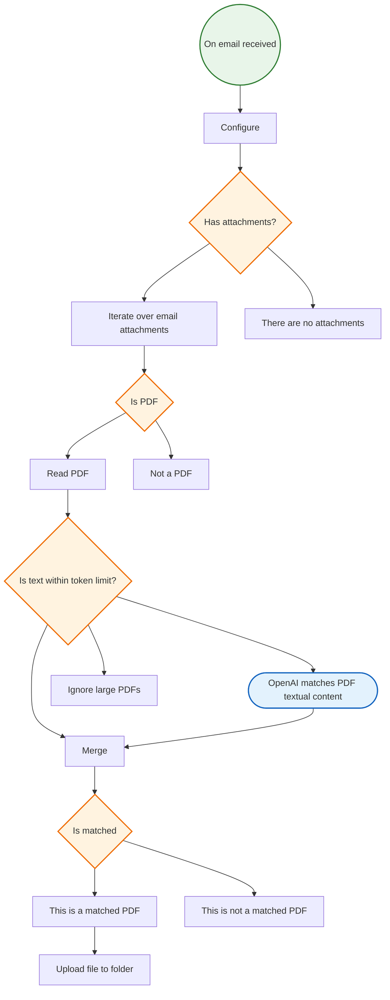

```mermaid
graph TD
    classDef trigger fill:#e8f5e9,stroke:#2e7d32,stroke-width:2px;
    classDef ai fill:#e3f2fd,stroke:#1565c0,stroke-width:2px;
    classDef logic fill:#fff3e0,stroke:#ef6c00,stroke-width:2px;

    Read_PDF["Read PDF"]
    Configure["Configure"]
    Is_PDF{"Is PDF"}:::logic
    Not_a_PDF["Not a PDF"]
    Is_matched{"Is matched"}:::logic
    This_is_a_matched_PDF["This is a matched PDF"]
    This_is_not_a_matched_PDF["This is not a matched PDF"]
    Iterate_over_email_attachments["Iterate over email attachments"]
    OpenAI_matches_PDF_textual_content(["OpenAI matches PDF textual content"]):::ai
    Merge["Merge"]
    Upload_file_to_folder["Upload file to folder"]
    On_email_received(("On email received")):::trigger
    Ignore_large_PDFs["Ignore large PDFs"]
    Is_text_within_token_limit_{"Is text within token limit?"}:::logic
    Has_attachments_{"Has attachments?"}:::logic
    There_are_no_attachments["There are no attachments"]

    Merge --> Is_matched
    Is_PDF --> Read_PDF
    Is_PDF --> Not_a_PDF
    Read_PDF --> Is_text_within_token_limit_
    Configure --> Has_attachments_
    Is_matched --> This_is_a_matched_PDF
    Is_matched --> This_is_not_a_matched_PDF
    Has_attachments_ --> Iterate_over_email_attachments
    Has_attachments_ --> There_are_no_attachments
    On_email_received --> Configure
    This_is_a_matched_PDF --> Upload_file_to_folder
    Is_text_within_token_limit_ --> OpenAI_matches_PDF_textual_content
    Is_text_within_token_limit_ --> Merge
    Is_text_within_token_limit_ --> Ignore_large_PDFs
    Iterate_over_email_attachments --> Is_PDF
    OpenAI_matches_PDF_textual_content --> Merge
```
