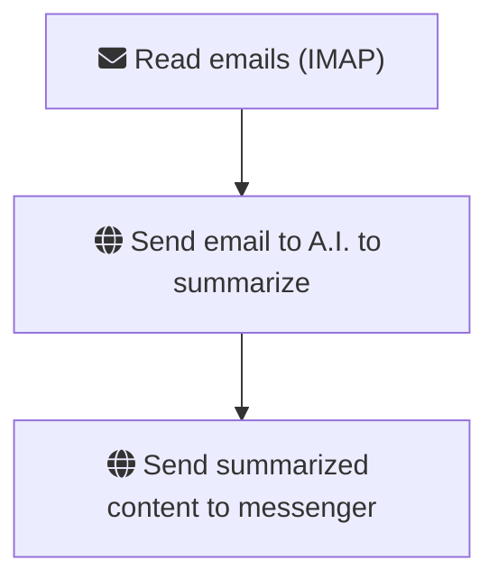

```mermaid
graph TD
    classDef trigger fill:#e8f5e9,stroke:#2e7d32,stroke-width:2px;
    classDef ai fill:#e3f2fd,stroke:#1565c0,stroke-width:2px;
    classDef logic fill:#fff3e0,stroke:#ef6c00,stroke-width:2px;

    Read_emails__IMAP_["fas:fa-envelope Read emails (IMAP)"]
    Send_email_to_A_I__to_summarize["fas:fa-globe Send email to A.I. to summarize"]
    Send_summarized_content_to_messenger["fas:fa-globe Send summarized content to messenger"]

    Read_emails__IMAP_ --> Send_email_to_A_I__to_summarize
    Send_email_to_A_I__to_summarize --> Send_summarized_content_to_messenger
```
