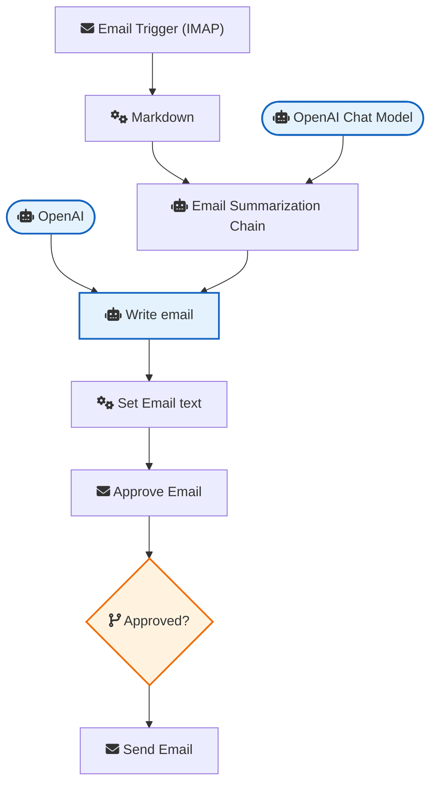

```mermaid
graph TD
    classDef trigger fill:#e8f5e9,stroke:#2e7d32,stroke-width:2px;
    classDef ai fill:#e3f2fd,stroke:#1565c0,stroke-width:2px;
    classDef logic fill:#fff3e0,stroke:#ef6c00,stroke-width:2px;

    Email_Trigger__IMAP_["fas:fa-envelope Email Trigger (IMAP)"]
    Markdown["fas:fa-cogs Markdown"]
    Send_Email["fas:fa-envelope Send Email"]
    Email_Summarization_Chain["fas:fa-robot Email Summarization Chain"]
    Write_email["fas:fa-robot Write email"]:::ai
    OpenAI(["fas:fa-robot OpenAI"]):::ai
    Approve_Email["fas:fa-envelope Approve Email"]
    OpenAI_Chat_Model(["fas:fa-robot OpenAI Chat Model"]):::ai
    Set_Email_text["fas:fa-cogs Set Email text"]
    Approved_{"fas:fa-code-branch Approved?"}:::logic

    OpenAI --> Write_email
    Markdown --> Email_Summarization_Chain
    Approved_ --> Send_Email
    Write_email --> Set_Email_text
    Approve_Email --> Approved_
    Set_Email_text --> Approve_Email
    OpenAI_Chat_Model --> Email_Summarization_Chain
    Email_Trigger__IMAP_ --> Markdown
    Email_Summarization_Chain --> Write_email
```
