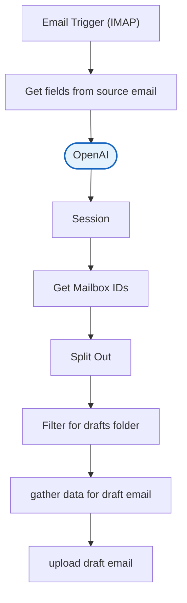

```mermaid
graph TD
    classDef trigger fill:#e8f5e9,stroke:#2e7d32,stroke-width:2px;
    classDef ai fill:#e3f2fd,stroke:#1565c0,stroke-width:2px;
    classDef logic fill:#fff3e0,stroke:#ef6c00,stroke-width:2px;

    Session["Session"]
    Get_Mailbox_IDs["Get Mailbox IDs"]
    Split_Out["Split Out"]
    Email_Trigger__IMAP_["Email Trigger (IMAP)"]
    Get_fields_from_source_email["Get fields from source email"]
    OpenAI(["OpenAI"]):::ai
    Filter_for_drafts_folder["Filter for drafts folder"]
    upload_draft_email["upload draft email"]
    gather_data_for_draft_email["gather data for draft email"]

    OpenAI --> Session
    Session --> Get_Mailbox_IDs
    Split_Out --> Filter_for_drafts_folder
    Get_Mailbox_IDs --> Split_Out
    Email_Trigger__IMAP_ --> Get_fields_from_source_email
    Filter_for_drafts_folder --> gather_data_for_draft_email
    gather_data_for_draft_email --> upload_draft_email
    Get_fields_from_source_email --> OpenAI
```
