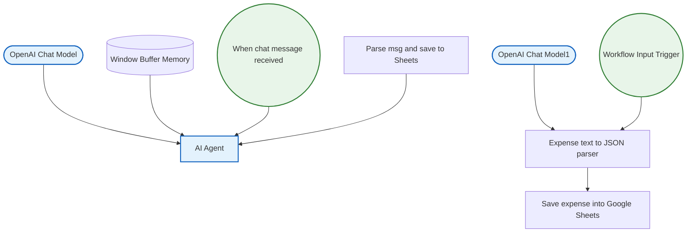

```mermaid
graph TD
    classDef trigger fill:#e8f5e9,stroke:#2e7d32,stroke-width:2px;
    classDef ai fill:#e3f2fd,stroke:#1565c0,stroke-width:2px;
    classDef logic fill:#fff3e0,stroke:#ef6c00,stroke-width:2px;

    AI_Agent["AI Agent"]:::ai
    When_chat_message_received(("When chat message received")):::trigger
    Workflow_Input_Trigger(("Workflow Input Trigger")):::trigger
    OpenAI_Chat_Model(["OpenAI Chat Model"]):::ai
    Window_Buffer_Memory[("Window Buffer Memory")]
    OpenAI_Chat_Model1(["OpenAI Chat Model1"]):::ai
    Expense_text_to_JSON_parser["Expense text to JSON parser"]
    Save_expense_into_Google_Sheets["Save expense into Google Sheets"]
    Parse_msg_and_save_to_Sheets["Parse msg and save to Sheets"]

    OpenAI_Chat_Model --> AI_Agent
    OpenAI_Chat_Model1 --> Expense_text_to_JSON_parser
    Window_Buffer_Memory --> AI_Agent
    Workflow_Input_Trigger --> Expense_text_to_JSON_parser
    When_chat_message_received --> AI_Agent
    Expense_text_to_JSON_parser --> Save_expense_into_Google_Sheets
    Parse_msg_and_save_to_Sheets --> AI_Agent
```
