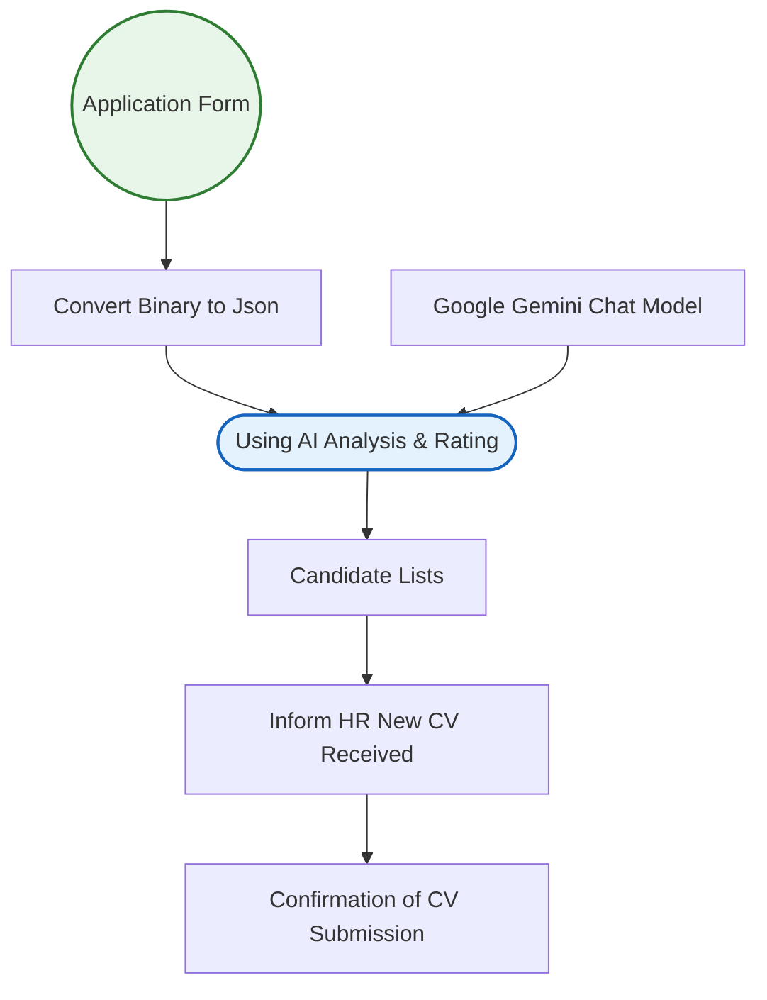

```mermaid
graph TD
    classDef trigger fill:#e8f5e9,stroke:#2e7d32,stroke-width:2px;
    classDef ai fill:#e3f2fd,stroke:#1565c0,stroke-width:2px;
    classDef logic fill:#fff3e0,stroke:#ef6c00,stroke-width:2px;

    Google_Gemini_Chat_Model["Google Gemini Chat Model"]
    Confirmation_of_CV_Submission["Confirmation of CV Submission"]
    Inform_HR_New_CV_Received["Inform HR New CV Received"]
    Using_AI_Analysis___Rating(["Using AI Analysis & Rating"]):::ai
    Convert_Binary_to_Json["Convert Binary to Json"]
    Application_Form(("Application Form")):::trigger
    Candidate_Lists["Candidate Lists"]

    Candidate_Lists --> Inform_HR_New_CV_Received
    Application_Form --> Convert_Binary_to_Json
    Convert_Binary_to_Json --> Using_AI_Analysis___Rating
    Google_Gemini_Chat_Model --> Using_AI_Analysis___Rating
    Inform_HR_New_CV_Received --> Confirmation_of_CV_Submission
    Using_AI_Analysis___Rating --> Candidate_Lists
```
