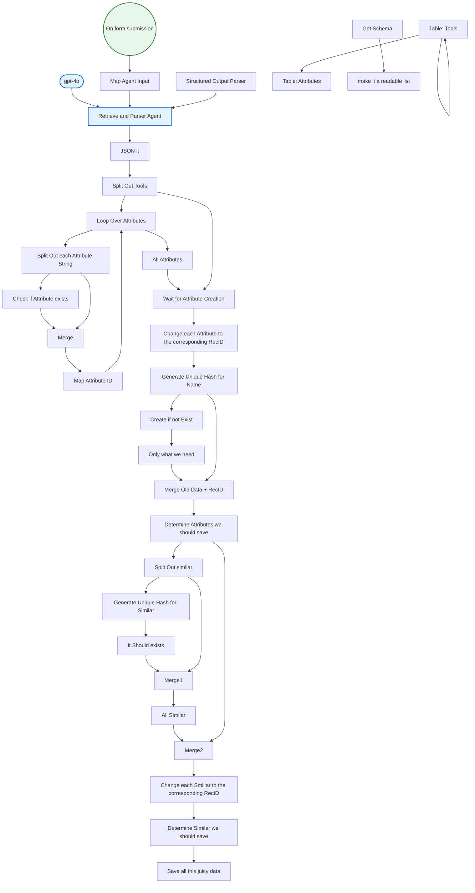

```mermaid
graph TD
    classDef trigger fill:#e8f5e9,stroke:#2e7d32,stroke-width:2px;
    classDef ai fill:#e3f2fd,stroke:#1565c0,stroke-width:2px;
    classDef logic fill:#fff3e0,stroke:#ef6c00,stroke-width:2px;

    On_form_submission(("On form submission")):::trigger
    Retrieve_and_Parser_Agent["Retrieve and Parser Agent"]:::ai
    JSON_it["JSON it"]
    Structured_Output_Parser["Structured Output Parser"]
    Check_if_Attribute_exists["Check if Attribute exists"]
    Merge["Merge"]
    Map_Attribute_ID["Map Attribute ID"]
    Loop_Over_Attributes["Loop Over Attributes"]
    All_Attributes["All Attributes"]
    Wait_for_Attribute_Creation["Wait for Attribute Creation"]
    Change_each_Attribute_to_the_corresponding_RecID["Change each Attribute to the corresponding RecID"]
    Split_Out_Tools["Split Out Tools"]
    Split_Out_each_Attribute_String["Split Out each Attribute String"]
    Generate_Unique_Hash_for_Name["Generate Unique Hash for Name"]
    Create_if_not_Exist["Create if not Exist"]
    Merge_Old_Data___RecID["Merge Old Data + RecID"]
    Only_what_we_need["Only what we need"]
    Determine_Attributes_we_should_save["Determine Attributes we should save"]
    Split_Out_similar["Split Out similar"]
    Merge1["Merge1"]
    Generate_Unique_Hash_for_Similar["Generate Unique Hash for Similar"]
    It_Should_exists["It Should exists"]
    All_Similar["All Similar"]
    Merge2["Merge2"]
    Change_each_Smiliar_to_the_corresponding_RecID["Change each Smiliar to the corresponding RecID"]
    Determine_Similar_we_should_save["Determine Similar we should save"]
    Save_all_this_juicy_data["Save all this juicy data"]
    Map_Agent_Input["Map Agent Input"]
    gpt_4o(["gpt-4o"]):::ai
    Table__Tools["Table: Tools"]
    Table__Attributes["Table: Attributes"]
    make_it_a_readable_list["make it a readable list"]
    Get_Schema["Get Schema"]

    Merge --> Map_Attribute_ID
    Merge1 --> All_Similar
    Merge2 --> Change_each_Smiliar_to_the_corresponding_RecID
    gpt_4o --> Retrieve_and_Parser_Agent
    JSON_it --> Split_Out_Tools
    Get_Schema --> make_it_a_readable_list
    All_Similar --> Merge2
    Table__Tools --> Table__Tools
    Table__Tools --> Table__Attributes
    All_Attributes --> Wait_for_Attribute_Creation
    Map_Agent_Input --> Retrieve_and_Parser_Agent
    Split_Out_Tools --> Loop_Over_Attributes
    Split_Out_Tools --> Wait_for_Attribute_Creation
    It_Should_exists --> Merge1
    Map_Attribute_ID --> Loop_Over_Attributes
    Only_what_we_need --> Merge_Old_Data___RecID
    Split_Out_similar --> Generate_Unique_Hash_for_Similar
    Split_Out_similar --> Merge1
    On_form_submission --> Map_Agent_Input
    Create_if_not_Exist --> Only_what_we_need
    Loop_Over_Attributes --> All_Attributes
    Loop_Over_Attributes --> Split_Out_each_Attribute_String
    Merge_Old_Data___RecID --> Determine_Attributes_we_should_save
    Structured_Output_Parser --> Retrieve_and_Parser_Agent
    Check_if_Attribute_exists --> Merge
    Retrieve_and_Parser_Agent --> JSON_it
    Wait_for_Attribute_Creation --> Change_each_Attribute_to_the_corresponding_RecID
    Generate_Unique_Hash_for_Name --> Create_if_not_Exist
    Generate_Unique_Hash_for_Name --> Merge_Old_Data___RecID
    Split_Out_each_Attribute_String --> Check_if_Attribute_exists
    Split_Out_each_Attribute_String --> Merge
    Determine_Similar_we_should_save --> Save_all_this_juicy_data
    Generate_Unique_Hash_for_Similar --> It_Should_exists
    Determine_Attributes_we_should_save --> Split_Out_similar
    Determine_Attributes_we_should_save --> Merge2
    Change_each_Smiliar_to_the_corresponding_RecID --> Determine_Similar_we_should_save
    Change_each_Attribute_to_the_corresponding_RecID --> Generate_Unique_Hash_for_Name
```
