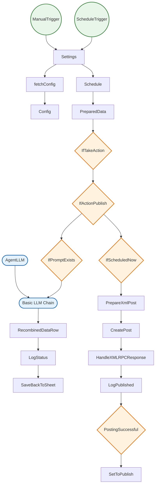

```mermaid
graph TD
    classDef trigger fill:#e8f5e9,stroke:#2e7d32,stroke-width:2px;
    classDef ai fill:#e3f2fd,stroke:#1565c0,stroke-width:2px;
    classDef logic fill:#fff3e0,stroke:#ef6c00,stroke-width:2px;

    Settings["Settings"]
    ScheduleTrigger(("ScheduleTrigger")):::trigger
    ManualTrigger(("ManualTrigger")):::trigger
    Schedule["Schedule"]
    Config["Config"]
    fetchConfig["fetchConfig"]
    AgentLLM(["AgentLLM"]):::ai
    IfScheduledNow{"IfScheduledNow"}:::logic
    PreparedData["PreparedData"]
    RecombinedDataRow["RecombinedDataRow"]
    SaveBackToSheet["SaveBackToSheet"]
    IfActionPublish{"IfActionPublish"}:::logic
    IfTakeAction{"IfTakeAction"}:::logic
    IfPromptExists{"IfPromptExists"}:::logic
    Basic_LLM_Chain(["Basic LLM Chain"]):::ai
    CreatePost["CreatePost"]
    SetToPublish["SetToPublish"]
    PrepareXmlPost["PrepareXmlPost"]
    HandleXMLRPCResponse["HandleXMLRPCResponse"]
    PostingSuccessful{"PostingSuccessful"}:::logic
    LogStatus["LogStatus"]
    LogPublished["LogPublished"]

    AgentLLM --> Basic_LLM_Chain
    Schedule --> PreparedData
    Settings --> fetchConfig
    Settings --> Schedule
    LogStatus --> SaveBackToSheet
    CreatePost --> HandleXMLRPCResponse
    fetchConfig --> Config
    IfTakeAction --> IfActionPublish
    LogPublished --> PostingSuccessful
    PreparedData --> IfTakeAction
    ManualTrigger --> Settings
    IfPromptExists --> Basic_LLM_Chain
    IfScheduledNow --> PrepareXmlPost
    PrepareXmlPost --> CreatePost
    Basic_LLM_Chain --> RecombinedDataRow
    IfActionPublish --> IfScheduledNow
    IfActionPublish --> IfPromptExists
    ScheduleTrigger --> Settings
    PostingSuccessful --> SetToPublish
    RecombinedDataRow --> LogStatus
    HandleXMLRPCResponse --> LogPublished
```
