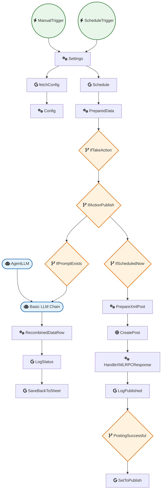

```mermaid
graph TD
    classDef trigger fill:#e8f5e9,stroke:#2e7d32,stroke-width:2px;
    classDef ai fill:#e3f2fd,stroke:#1565c0,stroke-width:2px;
    classDef logic fill:#fff3e0,stroke:#ef6c00,stroke-width:2px;

    Settings["fas:fa-cogs Settings"]
    ScheduleTrigger(("fas:fa-bolt ScheduleTrigger")):::trigger
    ManualTrigger(("fas:fa-bolt ManualTrigger")):::trigger
    Schedule["fab:fa-google Schedule"]
    Config["fas:fa-cogs Config"]
    fetchConfig["fab:fa-google fetchConfig"]
    AgentLLM(["fas:fa-robot AgentLLM"]):::ai
    IfScheduledNow{"fas:fa-code-branch IfScheduledNow"}:::logic
    PreparedData["fas:fa-cogs PreparedData"]
    RecombinedDataRow["fas:fa-cogs RecombinedDataRow"]
    SaveBackToSheet["fab:fa-google SaveBackToSheet"]
    IfActionPublish{"fas:fa-code-branch IfActionPublish"}:::logic
    IfTakeAction{"fas:fa-code-branch IfTakeAction"}:::logic
    IfPromptExists{"fas:fa-code-branch IfPromptExists"}:::logic
    Basic_LLM_Chain(["fas:fa-robot Basic LLM Chain"]):::ai
    CreatePost["fas:fa-globe CreatePost"]
    SetToPublish["fab:fa-google SetToPublish"]
    PrepareXmlPost["fas:fa-cogs PrepareXmlPost"]
    HandleXMLRPCResponse["fas:fa-cogs HandleXMLRPCResponse"]
    PostingSuccessful{"fas:fa-code-branch PostingSuccessful"}:::logic
    LogStatus["fab:fa-google LogStatus"]
    LogPublished["fab:fa-google LogPublished"]

    AgentLLM --> Basic_LLM_Chain
    Schedule --> PreparedData
    Settings --> fetchConfig
    Settings --> Schedule
    LogStatus --> SaveBackToSheet
    CreatePost --> HandleXMLRPCResponse
    fetchConfig --> Config
    IfTakeAction --> IfActionPublish
    LogPublished --> PostingSuccessful
    PreparedData --> IfTakeAction
    ManualTrigger --> Settings
    IfPromptExists --> Basic_LLM_Chain
    IfScheduledNow --> PrepareXmlPost
    PrepareXmlPost --> CreatePost
    Basic_LLM_Chain --> RecombinedDataRow
    IfActionPublish --> IfScheduledNow
    IfActionPublish --> IfPromptExists
    ScheduleTrigger --> Settings
    PostingSuccessful --> SetToPublish
    RecombinedDataRow --> LogStatus
    HandleXMLRPCResponse --> LogPublished
```
