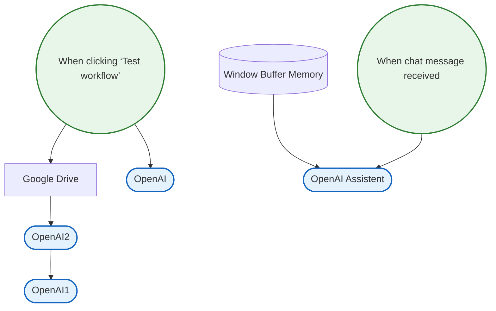

```mermaid
graph TD
    classDef trigger fill:#e8f5e9,stroke:#2e7d32,stroke-width:2px;
    classDef ai fill:#e3f2fd,stroke:#1565c0,stroke-width:2px;
    classDef logic fill:#fff3e0,stroke:#ef6c00,stroke-width:2px;

    When_clicking__Test_workflow_(("When clicking ‘Test workflow’")):::trigger
    Google_Drive["Google Drive"]
    When_chat_message_received(("When chat message received")):::trigger
    Window_Buffer_Memory[("Window Buffer Memory")]
    OpenAI(["OpenAI"]):::ai
    OpenAI2(["OpenAI2"]):::ai
    OpenAI1(["OpenAI1"]):::ai
    OpenAI_Assistent(["OpenAI Assistent"]):::ai

    OpenAI2 --> OpenAI1
    Google_Drive --> OpenAI2
    Window_Buffer_Memory --> OpenAI_Assistent
    When_chat_message_received --> OpenAI_Assistent
    When_clicking__Test_workflow_ --> OpenAI
    When_clicking__Test_workflow_ --> Google_Drive
```
