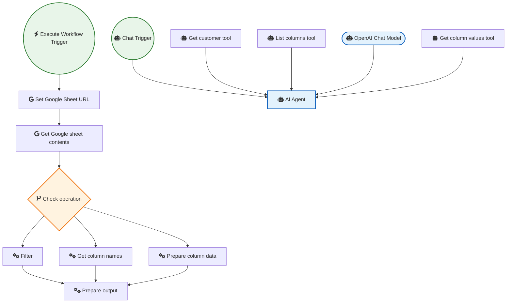

```mermaid
graph TD
    classDef trigger fill:#e8f5e9,stroke:#2e7d32,stroke-width:2px;
    classDef ai fill:#e3f2fd,stroke:#1565c0,stroke-width:2px;
    classDef logic fill:#fff3e0,stroke:#ef6c00,stroke-width:2px;

    Execute_Workflow_Trigger(("fas:fa-bolt Execute Workflow Trigger")):::trigger
    Get_Google_sheet_contents["fab:fa-google Get Google sheet contents"]
    Set_Google_Sheet_URL["fab:fa-google Set Google Sheet URL"]
    Get_column_names["fas:fa-cogs Get column names"]
    Prepare_output["fas:fa-cogs Prepare output"]
    List_columns_tool["fas:fa-robot List columns tool"]
    Get_customer_tool["fas:fa-robot Get customer tool"]
    Get_column_values_tool["fas:fa-robot Get column values tool"]
    Prepare_column_data["fas:fa-cogs Prepare column data"]
    Filter["fas:fa-cogs Filter"]
    Check_operation{"fas:fa-code-branch Check operation"}:::logic
    OpenAI_Chat_Model(["fas:fa-robot OpenAI Chat Model"]):::ai
    Chat_Trigger(("fas:fa-robot Chat Trigger")):::trigger
    AI_Agent["fas:fa-robot AI Agent"]:::ai

    Filter --> Prepare_output
    Chat_Trigger --> AI_Agent
    Check_operation --> Get_column_names
    Check_operation --> Prepare_column_data
    Check_operation --> Filter
    Get_column_names --> Prepare_output
    Get_customer_tool --> AI_Agent
    List_columns_tool --> AI_Agent
    OpenAI_Chat_Model --> AI_Agent
    Prepare_column_data --> Prepare_output
    Set_Google_Sheet_URL --> Get_Google_sheet_contents
    Get_column_values_tool --> AI_Agent
    Execute_Workflow_Trigger --> Set_Google_Sheet_URL
    Get_Google_sheet_contents --> Check_operation
```
