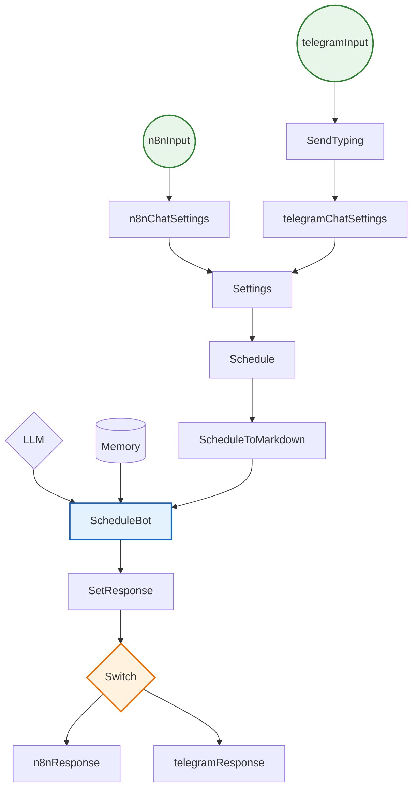

```mermaid
graph TD
    classDef trigger fill:#e8f5e9,stroke:#2e7d32,stroke-width:2px;
    classDef ai fill:#e3f2fd,stroke:#1565c0,stroke-width:2px;
    classDef logic fill:#fff3e0,stroke:#ef6c00,stroke-width:2px;

    SendTyping["SendTyping"]
    SetResponse["SetResponse"]
    Settings["Settings"]
    Schedule["Schedule"]
    ScheduleToMarkdown["ScheduleToMarkdown"]
    ScheduleBot["ScheduleBot"]:::ai
    n8nChatSettings["n8nChatSettings"]
    telegramChatSettings["telegramChatSettings"]
    telegramInput(("telegramInput")):::trigger
    n8nInput(("n8nInput")):::trigger
    Switch{"Switch"}:::logic
    telegramResponse["telegramResponse"]
    n8nResponse["n8nResponse"]
    LLM{"LLM"}
    Memory[("Memory")]

    LLM --> ScheduleBot
    Memory --> ScheduleBot
    Switch --> n8nResponse
    Switch --> telegramResponse
    Schedule --> ScheduleToMarkdown
    Settings --> Schedule
    n8nInput --> n8nChatSettings
    SendTyping --> telegramChatSettings
    ScheduleBot --> SetResponse
    SetResponse --> Switch
    telegramInput --> SendTyping
    n8nChatSettings --> Settings
    ScheduleToMarkdown --> ScheduleBot
    telegramChatSettings --> Settings
```
