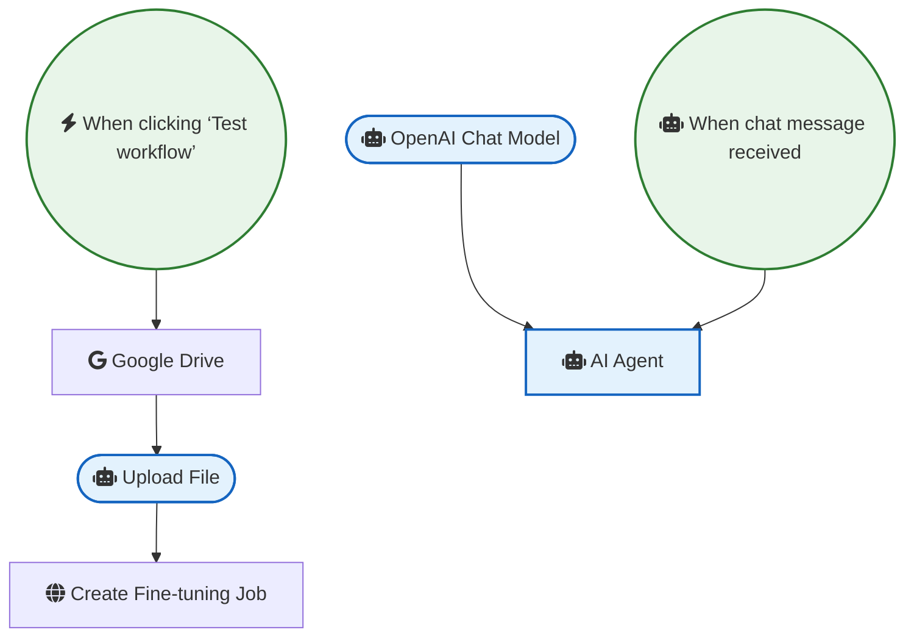

```mermaid
graph TD
    classDef trigger fill:#e8f5e9,stroke:#2e7d32,stroke-width:2px;
    classDef ai fill:#e3f2fd,stroke:#1565c0,stroke-width:2px;
    classDef logic fill:#fff3e0,stroke:#ef6c00,stroke-width:2px;

    When_clicking__Test_workflow_(("fas:fa-bolt When clicking ‘Test workflow’")):::trigger
    Google_Drive["fab:fa-google Google Drive"]
    AI_Agent["fas:fa-robot AI Agent"]:::ai
    When_chat_message_received(("fas:fa-robot When chat message received")):::trigger
    OpenAI_Chat_Model(["fas:fa-robot OpenAI Chat Model"]):::ai
    Upload_File(["fas:fa-robot Upload File"]):::ai
    Create_Fine_tuning_Job["fas:fa-globe Create Fine-tuning Job"]

    Upload_File --> Create_Fine_tuning_Job
    Google_Drive --> Upload_File
    OpenAI_Chat_Model --> AI_Agent
    When_chat_message_received --> AI_Agent
    When_clicking__Test_workflow_ --> Google_Drive
```
