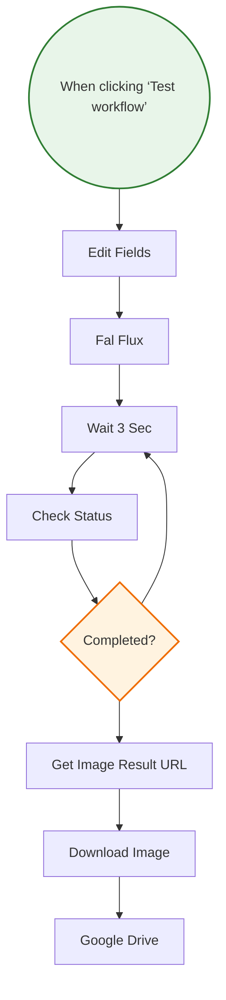

```mermaid
graph TD
    classDef trigger fill:#e8f5e9,stroke:#2e7d32,stroke-width:2px;
    classDef ai fill:#e3f2fd,stroke:#1565c0,stroke-width:2px;
    classDef logic fill:#fff3e0,stroke:#ef6c00,stroke-width:2px;

    Fal_Flux["Fal Flux"]
    Get_Image_Result_URL["Get Image Result URL"]
    Download_Image["Download Image"]
    Google_Drive["Google Drive"]
    When_clicking__Test_workflow_(("When clicking ‘Test workflow’")):::trigger
    Wait_3_Sec["Wait 3 Sec"]
    Check_Status["Check Status"]
    Completed_{"Completed?"}:::logic
    Edit_Fields["Edit Fields"]

    Fal_Flux --> Wait_3_Sec
    Completed_ --> Get_Image_Result_URL
    Completed_ --> Wait_3_Sec
    Wait_3_Sec --> Check_Status
    Edit_Fields --> Fal_Flux
    Check_Status --> Completed_
    Download_Image --> Google_Drive
    Get_Image_Result_URL --> Download_Image
    When_clicking__Test_workflow_ --> Edit_Fields
```
