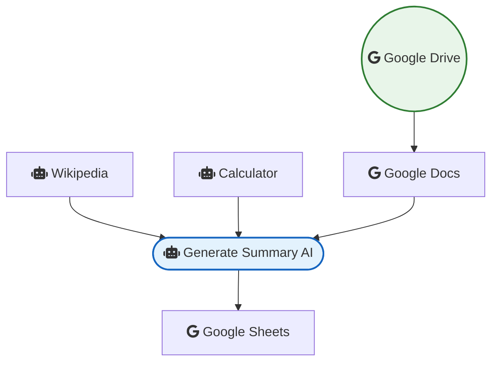

```mermaid
graph TD
    classDef trigger fill:#e8f5e9,stroke:#2e7d32,stroke-width:2px;
    classDef ai fill:#e3f2fd,stroke:#1565c0,stroke-width:2px;
    classDef logic fill:#fff3e0,stroke:#ef6c00,stroke-width:2px;

    Google_Docs["fab:fa-google Google Docs"]
    Wikipedia["fas:fa-robot Wikipedia"]
    Calculator["fas:fa-robot Calculator"]
    Google_Sheets["fab:fa-google Google Sheets"]
    Google_Drive_(("fab:fa-google Google Drive ")):::trigger
    Generate_Summary_AI(["fas:fa-robot Generate Summary AI"]):::ai

    Wikipedia --> Generate_Summary_AI
    Calculator --> Generate_Summary_AI
    Google_Docs --> Generate_Summary_AI
    Google_Drive_ --> Google_Docs
    Generate_Summary_AI --> Google_Sheets
```
