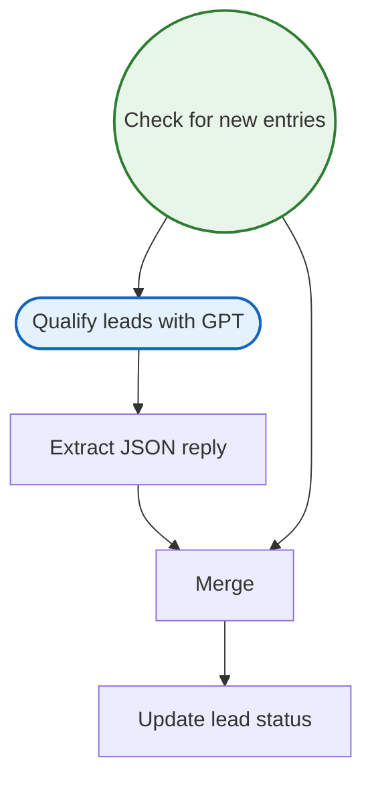

```mermaid
graph TD
    classDef trigger fill:#e8f5e9,stroke:#2e7d32,stroke-width:2px;
    classDef ai fill:#e3f2fd,stroke:#1565c0,stroke-width:2px;
    classDef logic fill:#fff3e0,stroke:#ef6c00,stroke-width:2px;

    Merge["Merge"]
    Update_lead_status["Update lead status"]
    Extract_JSON_reply["Extract JSON reply"]
    Qualify_leads_with_GPT(["Qualify leads with GPT"]):::ai
    Check_for_new_entries(("Check for new entries")):::trigger

    Merge --> Update_lead_status
    Extract_JSON_reply --> Merge
    Check_for_new_entries --> Merge
    Check_for_new_entries --> Qualify_leads_with_GPT
    Qualify_leads_with_GPT --> Extract_JSON_reply
```
