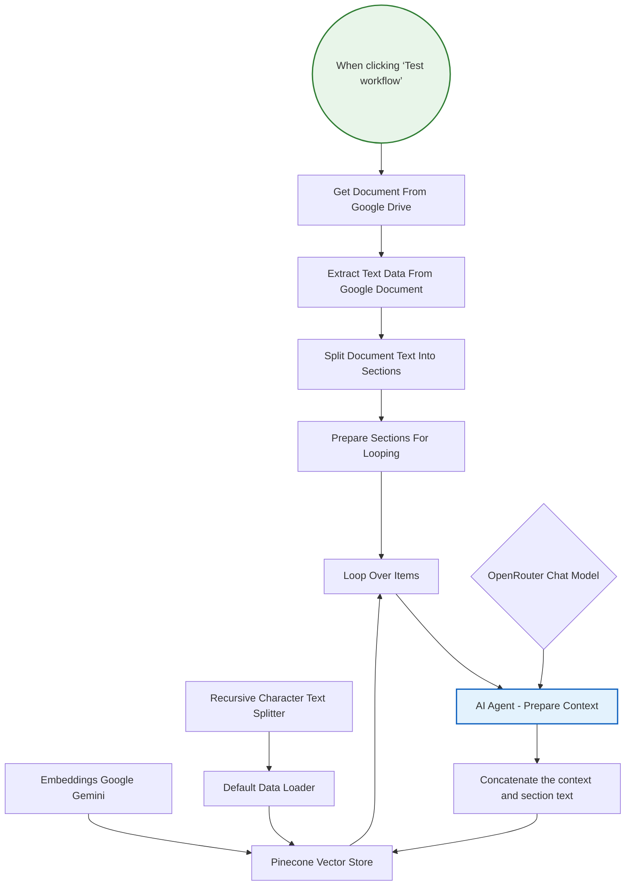

```mermaid
graph TD
    classDef trigger fill:#e8f5e9,stroke:#2e7d32,stroke-width:2px;
    classDef ai fill:#e3f2fd,stroke:#1565c0,stroke-width:2px;
    classDef logic fill:#fff3e0,stroke:#ef6c00,stroke-width:2px;

    When_clicking__Test_workflow_(("When clicking ‘Test workflow’")):::trigger
    Loop_Over_Items["Loop Over Items"]
    OpenRouter_Chat_Model{"OpenRouter Chat Model"}
    Pinecone_Vector_Store["Pinecone Vector Store"]
    Embeddings_Google_Gemini["Embeddings Google Gemini"]
    Default_Data_Loader["Default Data Loader"]
    Recursive_Character_Text_Splitter["Recursive Character Text Splitter"]
    Get_Document_From_Google_Drive["Get Document From Google Drive"]
    Extract_Text_Data_From_Google_Document["Extract Text Data From Google Document"]
    Split_Document_Text_Into_Sections["Split Document Text Into Sections"]
    Prepare_Sections_For_Looping["Prepare Sections For Looping"]
    AI_Agent___Prepare_Context["AI Agent - Prepare Context"]:::ai
    Concatenate_the_context_and_section_text["Concatenate the context and section text"]

    Loop_Over_Items --> AI_Agent___Prepare_Context
    Default_Data_Loader --> Pinecone_Vector_Store
    OpenRouter_Chat_Model --> AI_Agent___Prepare_Context
    Pinecone_Vector_Store --> Loop_Over_Items
    Embeddings_Google_Gemini --> Pinecone_Vector_Store
    AI_Agent___Prepare_Context --> Concatenate_the_context_and_section_text
    Prepare_Sections_For_Looping --> Loop_Over_Items
    Get_Document_From_Google_Drive --> Extract_Text_Data_From_Google_Document
    Recursive_Character_Text_Splitter --> Default_Data_Loader
    Split_Document_Text_Into_Sections --> Prepare_Sections_For_Looping
    When_clicking__Test_workflow_ --> Get_Document_From_Google_Drive
    Extract_Text_Data_From_Google_Document --> Split_Document_Text_Into_Sections
    Concatenate_the_context_and_section_text --> Pinecone_Vector_Store
```
