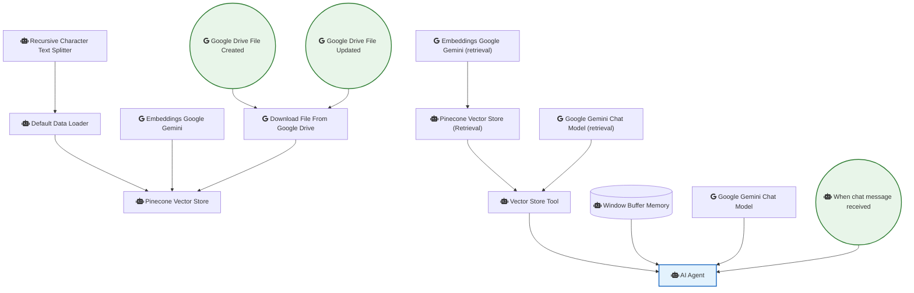

```mermaid
graph TD
    classDef trigger fill:#e8f5e9,stroke:#2e7d32,stroke-width:2px;
    classDef ai fill:#e3f2fd,stroke:#1565c0,stroke-width:2px;
    classDef logic fill:#fff3e0,stroke:#ef6c00,stroke-width:2px;

    Pinecone_Vector_Store["fas:fa-robot Pinecone Vector Store"]
    Embeddings_Google_Gemini["fab:fa-google Embeddings Google Gemini"]
    Default_Data_Loader["fas:fa-robot Default Data Loader"]
    Recursive_Character_Text_Splitter["fas:fa-robot Recursive Character Text Splitter"]
    AI_Agent["fas:fa-robot AI Agent"]:::ai
    Vector_Store_Tool["fas:fa-robot Vector Store Tool"]
    Pinecone_Vector_Store__Retrieval_["fas:fa-robot Pinecone Vector Store (Retrieval)"]
    Embeddings_Google_Gemini__retrieval_["fab:fa-google Embeddings Google Gemini (retrieval)"]
    Download_File_From_Google_Drive["fab:fa-google Download File From Google Drive"]
    Google_Drive_File_Updated(("fab:fa-google Google Drive File Updated")):::trigger
    Google_Drive_File_Created(("fab:fa-google Google Drive File Created")):::trigger
    Window_Buffer_Memory[("fas:fa-robot Window Buffer Memory")]
    When_chat_message_received(("fas:fa-robot When chat message received")):::trigger
    Google_Gemini_Chat_Model["fab:fa-google Google Gemini Chat Model"]
    Google_Gemini_Chat_Model__retrieval_["fab:fa-google Google Gemini Chat Model (retrieval)"]

    Vector_Store_Tool --> AI_Agent
    Default_Data_Loader --> Pinecone_Vector_Store
    Window_Buffer_Memory --> AI_Agent
    Embeddings_Google_Gemini --> Pinecone_Vector_Store
    Google_Gemini_Chat_Model --> AI_Agent
    Google_Drive_File_Created --> Download_File_From_Google_Drive
    Google_Drive_File_Updated --> Download_File_From_Google_Drive
    When_chat_message_received --> AI_Agent
    Download_File_From_Google_Drive --> Pinecone_Vector_Store
    Pinecone_Vector_Store__Retrieval_ --> Vector_Store_Tool
    Recursive_Character_Text_Splitter --> Default_Data_Loader
    Embeddings_Google_Gemini__retrieval_ --> Pinecone_Vector_Store__Retrieval_
    Google_Gemini_Chat_Model__retrieval_ --> Vector_Store_Tool
```
