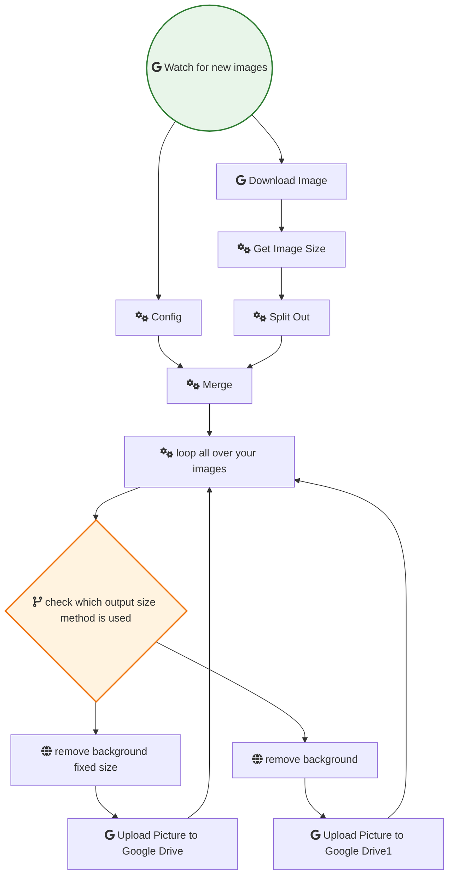

```mermaid
graph TD
    classDef trigger fill:#e8f5e9,stroke:#2e7d32,stroke-width:2px;
    classDef ai fill:#e3f2fd,stroke:#1565c0,stroke-width:2px;
    classDef logic fill:#fff3e0,stroke:#ef6c00,stroke-width:2px;

    Config["fas:fa-cogs Config"]
    remove_background["fas:fa-globe remove background"]
    Split_Out["fas:fa-cogs Split Out"]
    Upload_Picture_to_Google_Drive["fab:fa-google Upload Picture to Google Drive"]
    remove_background_fixed_size["fas:fa-globe remove background fixed size"]
    Merge["fas:fa-cogs Merge"]
    Upload_Picture_to_Google_Drive1["fab:fa-google Upload Picture to Google Drive1"]
    Download_Image["fab:fa-google Download Image"]
    Get_Image_Size["fas:fa-cogs Get Image Size"]
    Watch_for_new_images(("fab:fa-google Watch for new images")):::trigger
    check_which_output_size_method_is_used{"fas:fa-code-branch check which output size method is used"}:::logic
    loop_all_over_your_images["fas:fa-cogs loop all over your images"]

    Merge --> loop_all_over_your_images
    Config --> Merge
    Split_Out --> Merge
    Download_Image --> Get_Image_Size
    Get_Image_Size --> Split_Out
    remove_background --> Upload_Picture_to_Google_Drive1
    Watch_for_new_images --> Download_Image
    Watch_for_new_images --> Config
    loop_all_over_your_images --> check_which_output_size_method_is_used
    remove_background_fixed_size --> Upload_Picture_to_Google_Drive
    Upload_Picture_to_Google_Drive --> loop_all_over_your_images
    Upload_Picture_to_Google_Drive1 --> loop_all_over_your_images
    check_which_output_size_method_is_used --> remove_background_fixed_size
    check_which_output_size_method_is_used --> remove_background
```
