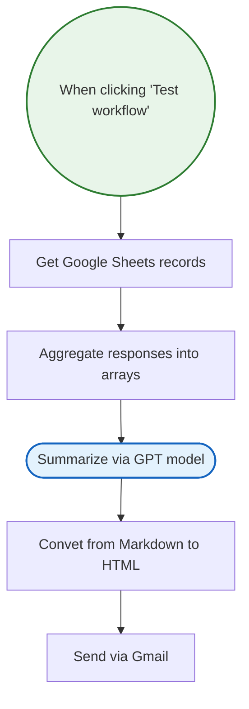

```mermaid
graph TD
    classDef trigger fill:#e8f5e9,stroke:#2e7d32,stroke-width:2px;
    classDef ai fill:#e3f2fd,stroke:#1565c0,stroke-width:2px;
    classDef logic fill:#fff3e0,stroke:#ef6c00,stroke-width:2px;

    When_clicking__Test_workflow_(("When clicking 'Test workflow'")):::trigger
    Get_Google_Sheets_records["Get Google Sheets records"]
    Aggregate_responses_into_arrays["Aggregate responses into arrays"]
    Summarize_via_GPT_model(["Summarize via GPT model"]):::ai
    Convet_from_Markdown_to_HTML["Convet from Markdown to HTML"]
    Send_via_Gmail["Send via Gmail"]

    Summarize_via_GPT_model --> Convet_from_Markdown_to_HTML
    Get_Google_Sheets_records --> Aggregate_responses_into_arrays
    Convet_from_Markdown_to_HTML --> Send_via_Gmail
    When_clicking__Test_workflow_ --> Get_Google_Sheets_records
    Aggregate_responses_into_arrays --> Summarize_via_GPT_model
```
