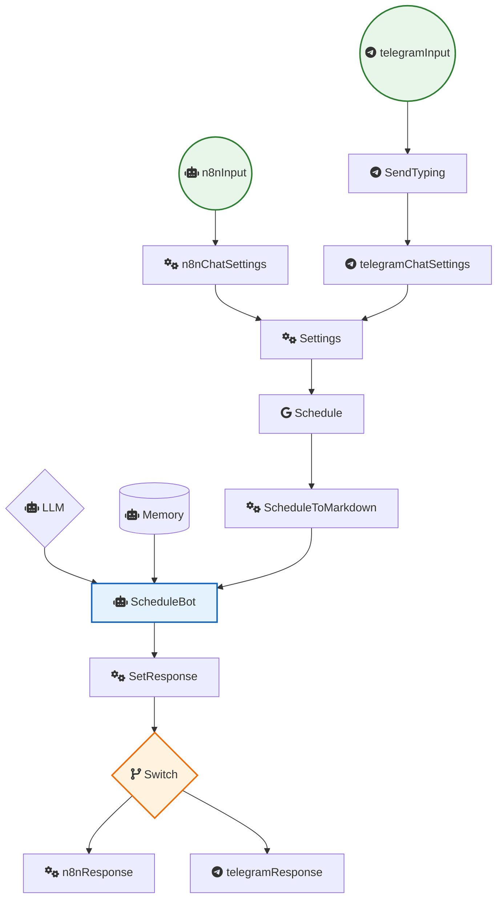

```mermaid
graph TD
    classDef trigger fill:#e8f5e9,stroke:#2e7d32,stroke-width:2px;
    classDef ai fill:#e3f2fd,stroke:#1565c0,stroke-width:2px;
    classDef logic fill:#fff3e0,stroke:#ef6c00,stroke-width:2px;

    SendTyping["fab:fa-telegram SendTyping"]
    SetResponse["fas:fa-cogs SetResponse"]
    Settings["fas:fa-cogs Settings"]
    Schedule["fab:fa-google Schedule"]
    ScheduleToMarkdown["fas:fa-cogs ScheduleToMarkdown"]
    ScheduleBot["fas:fa-robot ScheduleBot"]:::ai
    n8nChatSettings["fas:fa-cogs n8nChatSettings"]
    telegramChatSettings["fab:fa-telegram telegramChatSettings"]
    telegramInput(("fab:fa-telegram telegramInput")):::trigger
    n8nInput(("fas:fa-robot n8nInput")):::trigger
    Switch{"fas:fa-code-branch Switch"}:::logic
    telegramResponse["fab:fa-telegram telegramResponse"]
    n8nResponse["fas:fa-cogs n8nResponse"]
    LLM{"fas:fa-robot LLM"}
    Memory[("fas:fa-robot Memory")]

    LLM --> ScheduleBot
    Memory --> ScheduleBot
    Switch --> n8nResponse
    Switch --> telegramResponse
    Schedule --> ScheduleToMarkdown
    Settings --> Schedule
    n8nInput --> n8nChatSettings
    SendTyping --> telegramChatSettings
    ScheduleBot --> SetResponse
    SetResponse --> Switch
    telegramInput --> SendTyping
    n8nChatSettings --> Settings
    ScheduleToMarkdown --> ScheduleBot
    telegramChatSettings --> Settings
```
