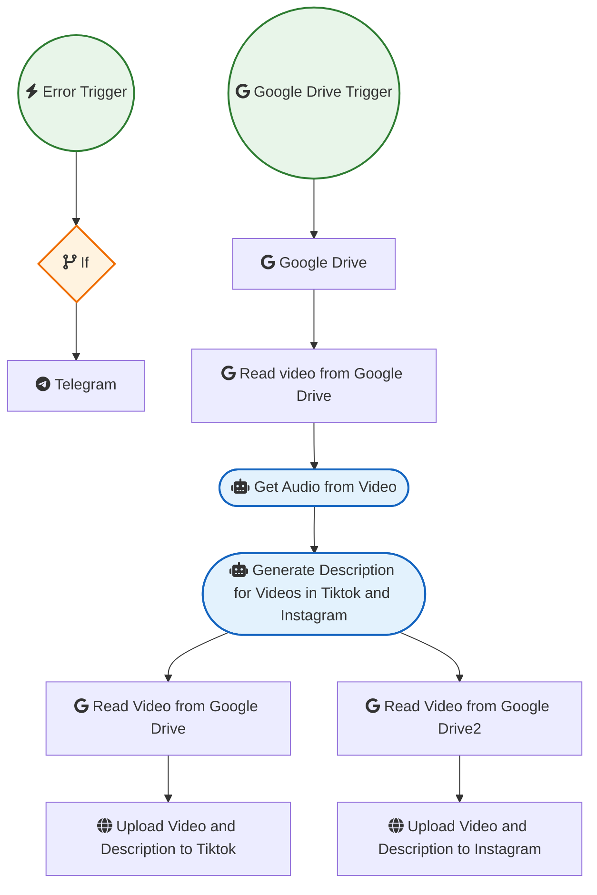

```mermaid
graph TD
    classDef trigger fill:#e8f5e9,stroke:#2e7d32,stroke-width:2px;
    classDef ai fill:#e3f2fd,stroke:#1565c0,stroke-width:2px;
    classDef logic fill:#fff3e0,stroke:#ef6c00,stroke-width:2px;

    Google_Drive_Trigger(("fab:fa-google Google Drive Trigger")):::trigger
    Google_Drive["fab:fa-google Google Drive"]
    Error_Trigger(("fas:fa-bolt Error Trigger")):::trigger
    Telegram["fab:fa-telegram Telegram"]
    If{"fas:fa-code-branch If"}:::logic
    Get_Audio_from_Video(["fas:fa-robot Get Audio from Video"]):::ai
    Read_video_from_Google_Drive["fab:fa-google Read video from Google Drive"]
    Generate_Description_for_Videos_in_Tiktok_and_Instagram(["fas:fa-robot Generate Description for Videos in Tiktok and Instagram"]):::ai
    Read_Video_from_Google_Drive["fab:fa-google Read Video from Google Drive"]
    Read_Video_from_Google_Drive2["fab:fa-google Read Video from Google Drive2"]
    Upload_Video_and_Description_to_Tiktok["fas:fa-globe Upload Video and Description to Tiktok"]
    Upload_Video_and_Description_to_Instagram["fas:fa-globe Upload Video and Description to Instagram"]

    If --> Telegram
    Google_Drive --> Read_video_from_Google_Drive
    Error_Trigger --> If
    Get_Audio_from_Video --> Generate_Description_for_Videos_in_Tiktok_and_Instagram
    Google_Drive_Trigger --> Google_Drive
    Read_Video_from_Google_Drive --> Upload_Video_and_Description_to_Tiktok
    Read_video_from_Google_Drive --> Get_Audio_from_Video
    Read_Video_from_Google_Drive2 --> Upload_Video_and_Description_to_Instagram
    Generate_Description_for_Videos_in_Tiktok_and_Instagram --> Read_Video_from_Google_Drive
    Generate_Description_for_Videos_in_Tiktok_and_Instagram --> Read_Video_from_Google_Drive2
```
