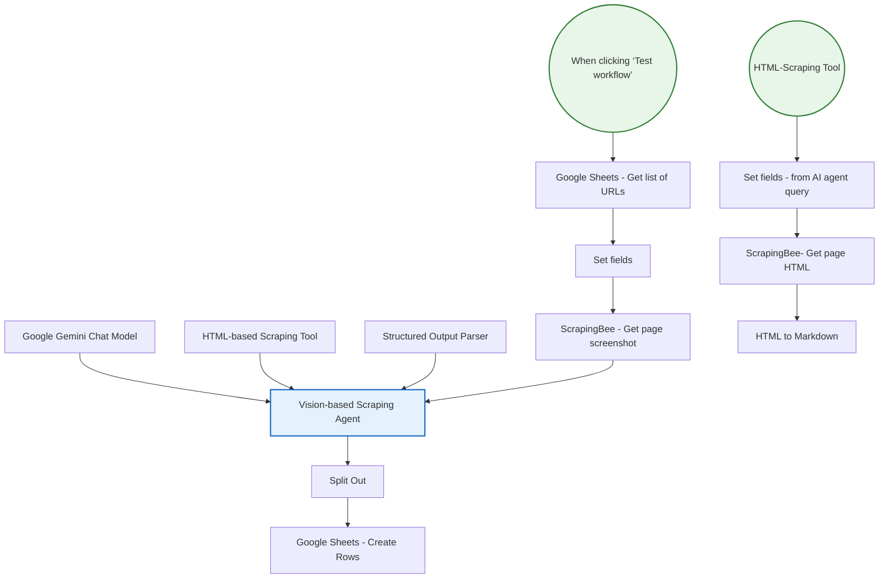

```mermaid
graph TD
    classDef trigger fill:#e8f5e9,stroke:#2e7d32,stroke-width:2px;
    classDef ai fill:#e3f2fd,stroke:#1565c0,stroke-width:2px;
    classDef logic fill:#fff3e0,stroke:#ef6c00,stroke-width:2px;

    When_clicking__Test_workflow_(("When clicking ‘Test workflow’")):::trigger
    ScrapingBee__Get_page_HTML["ScrapingBee- Get page HTML"]
    Structured_Output_Parser["Structured Output Parser"]
    Google_Gemini_Chat_Model["Google Gemini Chat Model"]
    Split_Out["Split Out"]
    Google_Sheets___Get_list_of_URLs["Google Sheets - Get list of URLs"]
    Set_fields["Set fields"]
    ScrapingBee___Get_page_screenshot["ScrapingBee - Get page screenshot"]
    HTML_based_Scraping_Tool["HTML-based Scraping Tool"]
    Google_Sheets___Create_Rows["Google Sheets - Create Rows"]
    Vision_based_Scraping_Agent["Vision-based Scraping Agent"]:::ai
    HTML_Scraping_Tool(("HTML-Scraping Tool")):::trigger
    Set_fields___from_AI_agent_query["Set fields - from AI agent query"]
    HTML_to_Markdown["HTML to Markdown"]

    Split_Out --> Google_Sheets___Create_Rows
    Set_fields --> ScrapingBee___Get_page_screenshot
    HTML_Scraping_Tool --> Set_fields___from_AI_agent_query
    Google_Gemini_Chat_Model --> Vision_based_Scraping_Agent
    HTML_based_Scraping_Tool --> Vision_based_Scraping_Agent
    Structured_Output_Parser --> Vision_based_Scraping_Agent
    ScrapingBee__Get_page_HTML --> HTML_to_Markdown
    Vision_based_Scraping_Agent --> Split_Out
    Google_Sheets___Get_list_of_URLs --> Set_fields
    Set_fields___from_AI_agent_query --> ScrapingBee__Get_page_HTML
    ScrapingBee___Get_page_screenshot --> Vision_based_Scraping_Agent
    When_clicking__Test_workflow_ --> Google_Sheets___Get_list_of_URLs
```
