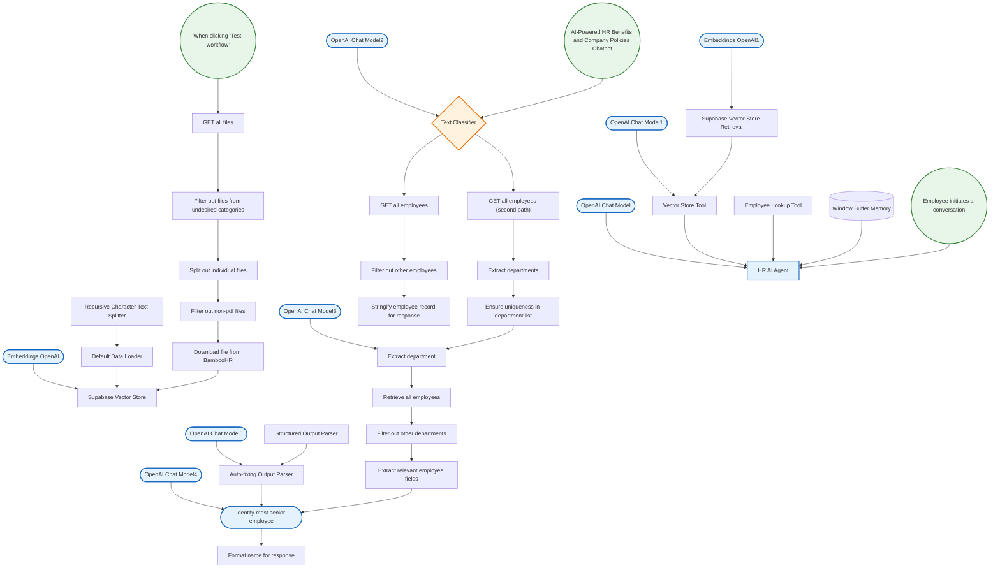

```mermaid
graph TD
    classDef trigger fill:#e8f5e9,stroke:#2e7d32,stroke-width:2px;
    classDef ai fill:#e3f2fd,stroke:#1565c0,stroke-width:2px;
    classDef logic fill:#fff3e0,stroke:#ef6c00,stroke-width:2px;

    When_clicking__Test_workflow_(("When clicking ‘Test workflow’")):::trigger
    Default_Data_Loader["Default Data Loader"]
    Embeddings_OpenAI(["Embeddings OpenAI"]):::ai
    Recursive_Character_Text_Splitter["Recursive Character Text Splitter"]
    Window_Buffer_Memory[("Window Buffer Memory")]
    OpenAI_Chat_Model(["OpenAI Chat Model"]):::ai
    Vector_Store_Tool["Vector Store Tool"]
    OpenAI_Chat_Model1(["OpenAI Chat Model1"]):::ai
    Embeddings_OpenAI1(["Embeddings OpenAI1"]):::ai
    Employee_Lookup_Tool["Employee Lookup Tool"]
    OpenAI_Chat_Model2(["OpenAI Chat Model2"]):::ai
    OpenAI_Chat_Model3(["OpenAI Chat Model3"]):::ai
    OpenAI_Chat_Model4(["OpenAI Chat Model4"]):::ai
    Auto_fixing_Output_Parser["Auto-fixing Output Parser"]
    OpenAI_Chat_Model5(["OpenAI Chat Model5"]):::ai
    Structured_Output_Parser["Structured Output Parser"]
    GET_all_files["GET all files"]
    Filter_out_files_from_undesired_categories["Filter out files from undesired categories"]
    Split_out_individual_files["Split out individual files"]
    Filter_out_non_pdf_files["Filter out non-pdf files"]
    Download_file_from_BambooHR["Download file from BambooHR"]
    Supabase_Vector_Store["Supabase Vector Store"]
    Employee_initiates_a_conversation(("Employee initiates a conversation")):::trigger
    Supabase_Vector_Store_Retrieval["Supabase Vector Store Retrieval"]
    AI_Powered_HR_Benefits_and_Company_Policies_Chatbot(("AI-Powered HR Benefits and Company Policies Chatbot")):::trigger
    Text_Classifier{"Text Classifier"}:::logic
    GET_all_employees["GET all employees"]
    Filter_out_other_employees["Filter out other employees"]
    Stringify_employee_record_for_response["Stringify employee record for response"]
    GET_all_employees__second_path_["GET all employees (second path)"]
    Extract_departments["Extract departments"]
    Ensure_uniqueness_in_department_list["Ensure uniqueness in department list"]
    Extract_department["Extract department"]
    Retrieve_all_employees["Retrieve all employees"]
    Filter_out_other_departments["Filter out other departments"]
    Extract_relevant_employee_fields["Extract relevant employee fields"]
    Identify_most_senior_employee(["Identify most senior employee"]):::ai
    Format_name_for_response["Format name for response"]
    HR_AI_Agent["HR AI Agent"]:::ai

    GET_all_files --> Filter_out_files_from_undesired_categories
    Text_Classifier --> GET_all_employees
    Text_Classifier --> GET_all_employees__second_path_
    Embeddings_OpenAI --> Supabase_Vector_Store
    GET_all_employees --> Filter_out_other_employees
    OpenAI_Chat_Model --> HR_AI_Agent
    Vector_Store_Tool --> HR_AI_Agent
    Embeddings_OpenAI1 --> Supabase_Vector_Store_Retrieval
    Extract_department --> Retrieve_all_employees
    OpenAI_Chat_Model1 --> Vector_Store_Tool
    OpenAI_Chat_Model2 --> Text_Classifier
    OpenAI_Chat_Model3 --> Extract_department
    OpenAI_Chat_Model4 --> Identify_most_senior_employee
    OpenAI_Chat_Model5 --> Auto_fixing_Output_Parser
    Default_Data_Loader --> Supabase_Vector_Store
    Extract_departments --> Ensure_uniqueness_in_department_list
    Employee_Lookup_Tool --> HR_AI_Agent
    Window_Buffer_Memory --> HR_AI_Agent
    Retrieve_all_employees --> Filter_out_other_departments
    Filter_out_non_pdf_files --> Download_file_from_BambooHR
    Structured_Output_Parser --> Auto_fixing_Output_Parser
    Auto_fixing_Output_Parser --> Identify_most_senior_employee
    Filter_out_other_employees --> Stringify_employee_record_for_response
    Split_out_individual_files --> Filter_out_non_pdf_files
    Download_file_from_BambooHR --> Supabase_Vector_Store
    Filter_out_other_departments --> Extract_relevant_employee_fields
    Identify_most_senior_employee --> Format_name_for_response
    GET_all_employees__second_path_ --> Extract_departments
    Supabase_Vector_Store_Retrieval --> Vector_Store_Tool
    Extract_relevant_employee_fields --> Identify_most_senior_employee
    Employee_initiates_a_conversation --> HR_AI_Agent
    Recursive_Character_Text_Splitter --> Default_Data_Loader
    When_clicking__Test_workflow_ --> GET_all_files
    Ensure_uniqueness_in_department_list --> Extract_department
    Filter_out_files_from_undesired_categories --> Split_out_individual_files
    AI_Powered_HR_Benefits_and_Company_Policies_Chatbot --> Text_Classifier
```
