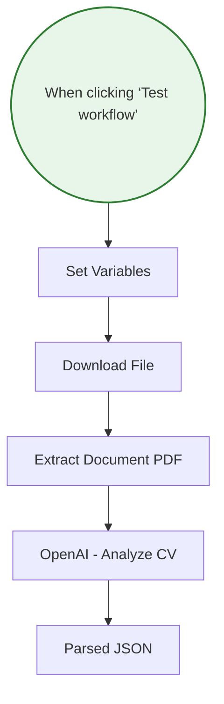

```mermaid
graph TD
    classDef trigger fill:#e8f5e9,stroke:#2e7d32,stroke-width:2px;
    classDef ai fill:#e3f2fd,stroke:#1565c0,stroke-width:2px;
    classDef logic fill:#fff3e0,stroke:#ef6c00,stroke-width:2px;

    Extract_Document_PDF["Extract Document PDF"]
    Download_File["Download File"]
    When_clicking__Test_workflow_(("When clicking ‘Test workflow’")):::trigger
    OpenAI___Analyze_CV["OpenAI - Analyze CV"]
    Set_Variables["Set Variables"]
    Parsed_JSON["Parsed JSON"]

    Download_File --> Extract_Document_PDF
    Set_Variables --> Download_File
    OpenAI___Analyze_CV --> Parsed_JSON
    Extract_Document_PDF --> OpenAI___Analyze_CV
    When_clicking__Test_workflow_ --> Set_Variables
```
