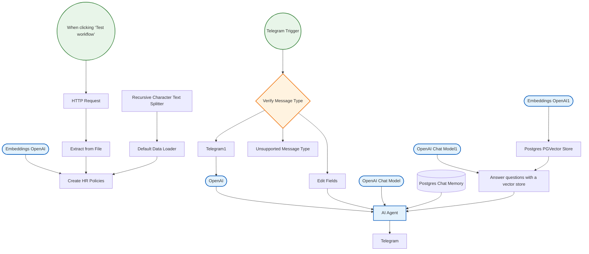

```mermaid
graph TD
    classDef trigger fill:#e8f5e9,stroke:#2e7d32,stroke-width:2px;
    classDef ai fill:#e3f2fd,stroke:#1565c0,stroke-width:2px;
    classDef logic fill:#fff3e0,stroke:#ef6c00,stroke-width:2px;

    When_clicking__Test_workflow_(("When clicking ‘Test workflow’")):::trigger
    HTTP_Request["HTTP Request"]
    Extract_from_File["Extract from File"]
    Create_HR_Policies["Create HR Policies"]
    Embeddings_OpenAI(["Embeddings OpenAI"]):::ai
    Default_Data_Loader["Default Data Loader"]
    Recursive_Character_Text_Splitter["Recursive Character Text Splitter"]
    Telegram_Trigger(("Telegram Trigger")):::trigger
    Verify_Message_Type{"Verify Message Type"}:::logic
    OpenAI(["OpenAI"]):::ai
    Telegram1["Telegram1"]
    Unsupported_Message_Type["Unsupported Message Type"]
    AI_Agent["AI Agent"]:::ai
    OpenAI_Chat_Model(["OpenAI Chat Model"]):::ai
    Postgres_Chat_Memory[("Postgres Chat Memory")]
    Answer_questions_with_a_vector_store["Answer questions with a vector store"]
    Postgres_PGVector_Store["Postgres PGVector Store"]
    OpenAI_Chat_Model1(["OpenAI Chat Model1"]):::ai
    Embeddings_OpenAI1(["Embeddings OpenAI1"]):::ai
    Telegram["Telegram"]
    Edit_Fields["Edit Fields"]

    OpenAI --> AI_Agent
    AI_Agent --> Telegram
    Telegram1 --> OpenAI
    Edit_Fields --> AI_Agent
    HTTP_Request --> Extract_from_File
    Telegram_Trigger --> Verify_Message_Type
    Embeddings_OpenAI --> Create_HR_Policies
    Extract_from_File --> Create_HR_Policies
    OpenAI_Chat_Model --> AI_Agent
    Embeddings_OpenAI1 --> Postgres_PGVector_Store
    OpenAI_Chat_Model1 --> Answer_questions_with_a_vector_store
    Default_Data_Loader --> Create_HR_Policies
    Verify_Message_Type --> Edit_Fields
    Verify_Message_Type --> Telegram1
    Verify_Message_Type --> Unsupported_Message_Type
    Postgres_Chat_Memory --> AI_Agent
    Postgres_PGVector_Store --> Answer_questions_with_a_vector_store
    Recursive_Character_Text_Splitter --> Default_Data_Loader
    When_clicking__Test_workflow_ --> HTTP_Request
    Answer_questions_with_a_vector_store --> AI_Agent
```
