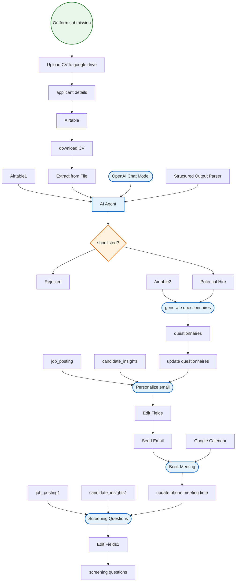

```mermaid
graph TD
    classDef trigger fill:#e8f5e9,stroke:#2e7d32,stroke-width:2px;
    classDef ai fill:#e3f2fd,stroke:#1565c0,stroke-width:2px;
    classDef logic fill:#fff3e0,stroke:#ef6c00,stroke-width:2px;

    On_form_submission(("On form submission")):::trigger
    Airtable["Airtable"]
    Upload_CV_to_google_drive["Upload CV to google drive"]
    applicant_details["applicant details"]
    download_CV["download CV"]
    Extract_from_File["Extract from File"]
    AI_Agent["AI Agent"]:::ai
    OpenAI_Chat_Model(["OpenAI Chat Model"]):::ai
    Airtable1["Airtable1"]
    Structured_Output_Parser["Structured Output Parser"]
    shortlisted_{"shortlisted?"}:::logic
    Rejected["Rejected"]
    Potential_Hire["Potential Hire"]
    Airtable2["Airtable2"]
    generate_questionnaires(["generate questionnaires"]):::ai
    questionnaires["questionnaires"]
    update_questionnaires["update questionnaires"]
    job_posting["job_posting"]
    candidate_insights["candidate_insights"]
    Personalize_email(["Personalize email"]):::ai
    Edit_Fields["Edit Fields"]
    Send_Email["Send Email"]
    Book_Meeting(["Book Meeting"]):::ai
    Google_Calendar["Google Calendar"]
    update_phone_meeting_time["update phone meeting time"]
    Screening_Questions(["Screening Questions"]):::ai
    job_posting1["job_posting1"]
    candidate_insights1["candidate_insights1"]
    screening_questions["screening questions"]
    Edit_Fields1["Edit Fields1"]

    AI_Agent --> shortlisted_
    Airtable --> download_CV
    Airtable1 --> AI_Agent
    Airtable2 --> generate_questionnaires
    Send_Email --> Book_Meeting
    Edit_Fields --> Send_Email
    download_CV --> Extract_from_File
    job_posting --> Personalize_email
    Book_Meeting --> update_phone_meeting_time
    Edit_Fields1 --> screening_questions
    job_posting1 --> Screening_Questions
    shortlisted_ --> Potential_Hire
    shortlisted_ --> Rejected
    Potential_Hire --> generate_questionnaires
    questionnaires --> update_questionnaires
    Google_Calendar --> Book_Meeting
    Extract_from_File --> AI_Agent
    OpenAI_Chat_Model --> AI_Agent
    Personalize_email --> Edit_Fields
    applicant_details --> Airtable
    On_form_submission --> Upload_CV_to_google_drive
    candidate_insights --> Personalize_email
    Screening_Questions --> Edit_Fields1
    candidate_insights1 --> Screening_Questions
    update_questionnaires --> Personalize_email
    generate_questionnaires --> questionnaires
    Structured_Output_Parser --> AI_Agent
    Upload_CV_to_google_drive --> applicant_details
    update_phone_meeting_time --> Screening_Questions
```
