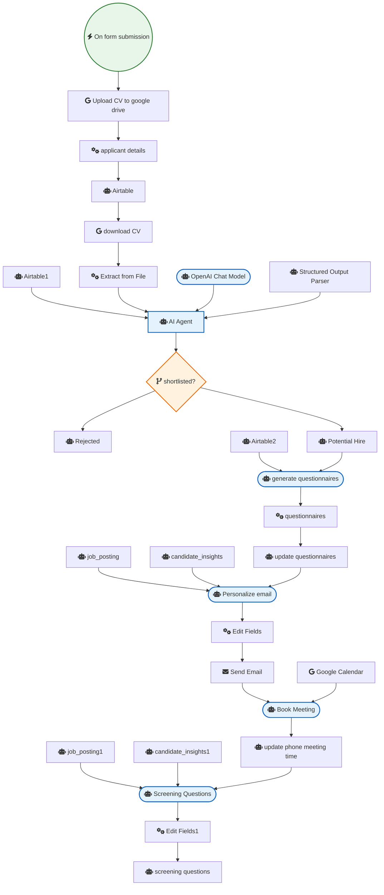

```mermaid
graph TD
    classDef trigger fill:#e8f5e9,stroke:#2e7d32,stroke-width:2px;
    classDef ai fill:#e3f2fd,stroke:#1565c0,stroke-width:2px;
    classDef logic fill:#fff3e0,stroke:#ef6c00,stroke-width:2px;

    On_form_submission(("fas:fa-bolt On form submission")):::trigger
    Airtable["fas:fa-robot Airtable"]
    Upload_CV_to_google_drive["fab:fa-google Upload CV to google drive"]
    applicant_details["fas:fa-cogs applicant details"]
    download_CV["fab:fa-google download CV"]
    Extract_from_File["fas:fa-cogs Extract from File"]
    AI_Agent["fas:fa-robot AI Agent"]:::ai
    OpenAI_Chat_Model(["fas:fa-robot OpenAI Chat Model"]):::ai
    Airtable1["fas:fa-robot Airtable1"]
    Structured_Output_Parser["fas:fa-robot Structured Output Parser"]
    shortlisted_{"fas:fa-code-branch shortlisted?"}:::logic
    Rejected["fas:fa-robot Rejected"]
    Potential_Hire["fas:fa-robot Potential Hire"]
    Airtable2["fas:fa-robot Airtable2"]
    generate_questionnaires(["fas:fa-robot generate questionnaires"]):::ai
    questionnaires["fas:fa-cogs questionnaires"]
    update_questionnaires["fas:fa-robot update questionnaires"]
    job_posting["fas:fa-robot job_posting"]
    candidate_insights["fas:fa-robot candidate_insights"]
    Personalize_email(["fas:fa-robot Personalize email"]):::ai
    Edit_Fields["fas:fa-cogs Edit Fields"]
    Send_Email["fas:fa-envelope Send Email"]
    Book_Meeting(["fas:fa-robot Book Meeting"]):::ai
    Google_Calendar["fab:fa-google Google Calendar"]
    update_phone_meeting_time["fas:fa-robot update phone meeting time"]
    Screening_Questions(["fas:fa-robot Screening Questions"]):::ai
    job_posting1["fas:fa-robot job_posting1"]
    candidate_insights1["fas:fa-robot candidate_insights1"]
    screening_questions["fas:fa-robot screening questions"]
    Edit_Fields1["fas:fa-cogs Edit Fields1"]

    AI_Agent --> shortlisted_
    Airtable --> download_CV
    Airtable1 --> AI_Agent
    Airtable2 --> generate_questionnaires
    Send_Email --> Book_Meeting
    Edit_Fields --> Send_Email
    download_CV --> Extract_from_File
    job_posting --> Personalize_email
    Book_Meeting --> update_phone_meeting_time
    Edit_Fields1 --> screening_questions
    job_posting1 --> Screening_Questions
    shortlisted_ --> Potential_Hire
    shortlisted_ --> Rejected
    Potential_Hire --> generate_questionnaires
    questionnaires --> update_questionnaires
    Google_Calendar --> Book_Meeting
    Extract_from_File --> AI_Agent
    OpenAI_Chat_Model --> AI_Agent
    Personalize_email --> Edit_Fields
    applicant_details --> Airtable
    On_form_submission --> Upload_CV_to_google_drive
    candidate_insights --> Personalize_email
    Screening_Questions --> Edit_Fields1
    candidate_insights1 --> Screening_Questions
    update_questionnaires --> Personalize_email
    generate_questionnaires --> questionnaires
    Structured_Output_Parser --> AI_Agent
    Upload_CV_to_google_drive --> applicant_details
    update_phone_meeting_time --> Screening_Questions
```
