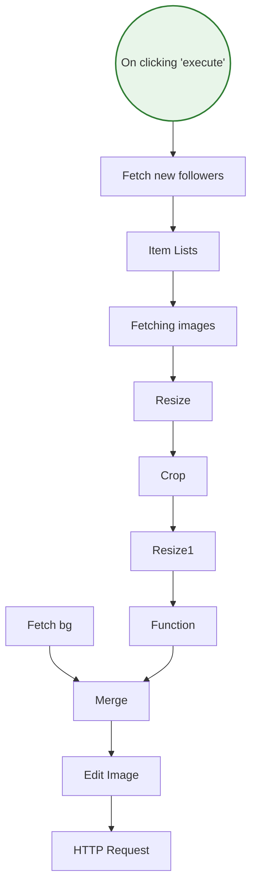

```mermaid
graph TD
    classDef trigger fill:#e8f5e9,stroke:#2e7d32,stroke-width:2px;
    classDef ai fill:#e3f2fd,stroke:#1565c0,stroke-width:2px;
    classDef logic fill:#fff3e0,stroke:#ef6c00,stroke-width:2px;

    On_clicking__execute_(("On clicking 'execute'")):::trigger
    Fetch_new_followers["Fetch new followers"]
    Item_Lists["Item Lists"]
    Function["Function"]
    Merge["Merge"]
    Fetching_images["Fetching images"]
    Fetch_bg["Fetch bg"]
    Resize["Resize"]
    Crop["Crop"]
    Edit_Image["Edit Image"]
    Resize1["Resize1"]
    HTTP_Request["HTTP Request"]

    Crop --> Resize1
    Merge --> Edit_Image
    Resize --> Crop
    Resize1 --> Function
    Fetch_bg --> Merge
    Function --> Merge
    Edit_Image --> HTTP_Request
    Item_Lists --> Fetching_images
    Fetching_images --> Resize
    Fetch_new_followers --> Item_Lists
    On_clicking__execute_ --> Fetch_new_followers
```
